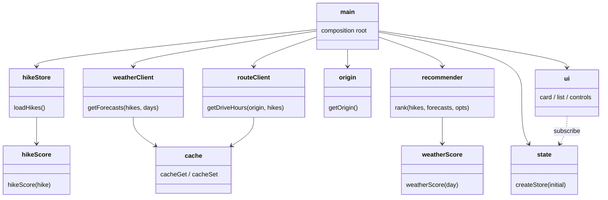
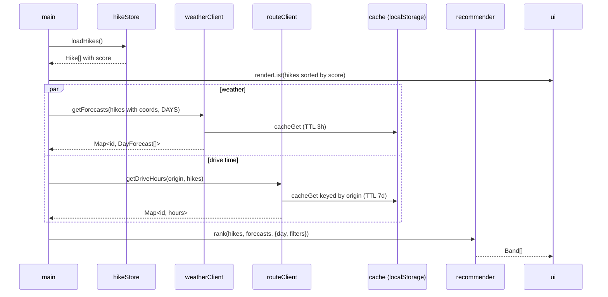
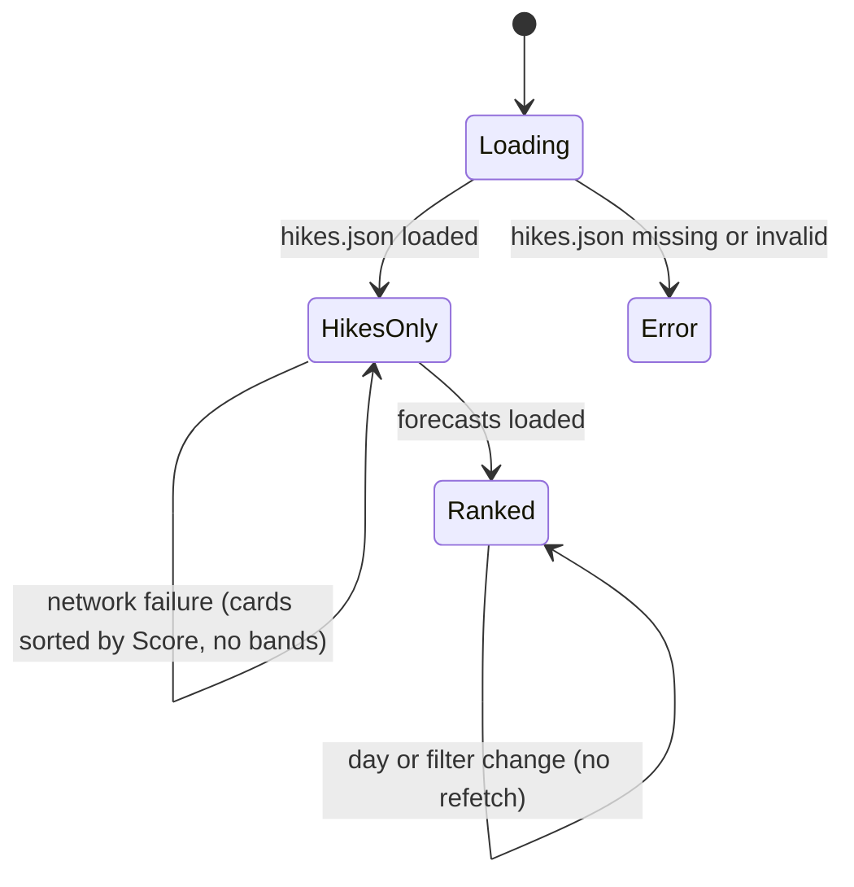

<!-- Created by Claude (claude-opus-5-5) -->
<!-- Date: 2026-09-28 -->

# Plan: Hiker Web App

| Field | Value |
|---|---|
| Status | In Progress |
| Created | 2026-09-28 |
| Updated | 2026-09-28 |
| Proficiency | 6/10 |
| Engine | Vanilla HTML / CSS / JS (ES modules), static hosting, no backend |
| Revisions | 9 (latest: U-009) |
| Summary | Hike cards ranked by the sheet's hike Score, grouped into weather bands per forecast day, with drive times. |

## Revision Log

| ID | Date | Type | Change |
|---|---|---|---|
| U-001 | 2026-09-28 | Update | Origin prefers saved home over geolocation; test command uses a glob; convert title-cases names; ui/dom.js element helper added. |
| U-002 | 2026-09-28 | Improvement | Card redesign: photo background from Wikimedia Commons, Flickr (geo search, key in untracked `.env.local`), Wikipedia or Openverse (build-time `tools/images.mjs` -> `data/images.json`, credit names author and licence; entries are checked by hand and `{rejected: [pages]}` marks turned-down photos), 7-day weather icon strip, Score and band labels hidden, list shows Good matches first, then the rest by Score (`goodFirst` in recommender.js). |
| U-003 | 2026-09-28 | Improvement | Home is set by place search (Open-Meteo geocoding, no key), typed lat, lon, or "Use my location", and saved with a name; filters sit in one fold-out; tag chips carry icons; the no-good-weather heading names the day. |
| U-004 | 2026-09-28 | Improvement | Clicking a card opens it enlarged in a modal (`ui/modal.js`, one shared `<dialog>`) with every tag and each day's low and rain chance; difficulty is a chip coloured green to red; "Use my location" is an icon button beside the Home search. |
| U-005 | 2026-09-28 | Improvement | Modal shows titled Distance, Time and Elevation facts and large day buttons (high, low, rain chance); choosing a day loads its hourly forecast, 6 AM to 9 PM (`weatherClient.getHourly`, `ui/weatherDetail.js`). |
| U-006 | 2026-09-28 | Improvement | Hikes can be added in the app (`ui/hikeForm.js`, `customHikes.js`): saved in localStorage, merged after `data/hikes.json`, removable from their modal, and exported as a drop-in `hikes.json`; `tools/add-hike.mjs` and the `/add-hike` skill append one from the command line with the same checks. Quality shows as a corner badge (award icon and "N/5"). |
| U-007 | 2026-09-28 | Improvement | The list shows the top `PAGE_SIZE` (6) cards; "Show 6 more" adds the next set and moves focus to the first new card. Changing the day or a filter starts again at the top 6; weather and drive-time updates keep the loaded cards. |
| U-008 | 2026-09-28 | Improvement | Drive time filter (`maxDriveHrs`: any, or up to 1, 2, 3, 4 or 6 h); hikes with no known drive time stay listed. |
| U-009 | 2026-09-28 | Improvement | Once drive times load, hikes without one go to the bottom of the list (`goodFirst(bands, driveHours)`); drives under an hour show in minutes. |

---

## Overview

A static web app that lists local hikes as cards. Each hike's Score (the existing sheet formula, lower = more reasonable) is computed at load time from raw fields in `data/hikes.json`, so new hikes score automatically. For a chosen forecast day, Open-Meteo weather at each hike's coordinates is scored with the ported `CALCULATE_WEATHER_SCORE_` and mapped to a band (Good / Fair / Poor / No-go). Cards are grouped by band and sorted by hike Score inside each band. Drive time from the user's location comes from the public OSRM table API. All data is local JSON; both network APIs are keyless and CORS-enabled.

Sources:
- Hikes sheet: `1eUzQCbDm2AfgOawIlJ-SIHXCTanjhqk5Lnr42b-yVX8` (sheets `Local`, `Database`, `Weather`)
- Flags sheet: `1g00f4stIu9Qpc4NAcMmX5gcQAIr5A8g6jrLbOunUUNE` (sheets `Months`, `Trail Tags`, `Access Tags`)

## Architecture



## Key Flows

### Startup and ranking



### App state



## Components

### hikeScore (`js/hikeScore.js`)
Responsibility: the only home of the sheet Score formula.
Pattern: Strategy (pure function injected where needed).

- `hikeScore(hike) -> number`: `((lengthKm*1000 + gainM*2) / (10/timeHrs)) * 2^difficulty * 2^accessibility / quality / 1000`. Verified against all 64 `Local` rows to 2 decimals.

### weatherScore (`js/weatherScore.js`)
Responsibility: exact port of `CALCULATE_WEATHER_SCORE_`.

- `weatherScore({highC, lowC, cloudPct, popPct, visKm}) -> number | Infinity`: Infinity when `highC >= 30 || highC <= 5`; otherwise `round((popPct*2 + cloudPct)^2 + 2^(visKm/30)) / 100`.
- `bandFor(score) -> 'good' | 'fair' | 'poor' | 'nogo'` using `BANDS` from config.

### hikeStore (`js/hikeStore.js`)
Responsibility: fetch and validate `data/hikes.json`, attach `score`.
Owns: `data/hikes.json`.

- `loadHikes() -> Promise<Hike[]>`: throws on missing required fields with the hike name in the message.

### customHikes (`js/customHikes.js`)
Responsibility: hikes added in the app, kept in localStorage (`hiker:customHikes`) until exported.

- `buildHike(fields, takenIds) -> Hike`: form strings to a hikes.json entry; throws one message listing every problem (missing fields, ratings outside 1 to 5, a name already in the list, a link that is not http or https).
- `exportHikesJson(hikes) -> string`: the whole list as `data/hikes.json`, without `score` or the in-app `custom` marker. An unchanged list exports byte for byte.
- A saved hike whose id is also in `data/hikes.json` is ignored, so committing an export retires the browser copy.

### weatherClient (`js/weatherClient.js`)
Responsibility: one batched Open-Meteo request for all hikes with coordinates.

- `getForecasts(hikes, days) -> Promise<Map<id, DayForecast[]>>`: daily `temperature_2m_max, temperature_2m_min, cloud_cover_mean, precipitation_probability_max, visibility_mean, weather_code`, `timezone=auto`. Converts `visibility_mean` metres to km.

### routeClient (`js/routeClient.js`)
Responsibility: drive hours from origin via `router.project-osrm.org/table/v1/driving` with `sources=0&annotations=duration`.

- `getDriveHours(origin, hikes) -> Promise<Map<id, number>>`: one request per origin; cache key is origin rounded to 2 decimals.

### origin (`js/origin.js`)
- `getOrigin() -> Promise<{lat, lon, source}>`: saved home from localStorage, else browser geolocation, else `config.DEFAULT_HOME`. A saved home is an explicit choice, so it wins.
- `saveHome({lat, lon, name})`.
- `searchPlaces(query) -> Promise<{name, lat, lon}[]>`: up to 5 matches from Open-Meteo geocoding.
- `locate() -> Promise<{lat, lon}>`: browser geolocation.

### cache (`js/cache.js`)
- `cacheGet(key) -> value | null`, `cacheSet(key, value, ttlMs)`. All storage access wrapped in try/catch.

### recommender (`js/recommender.js`)
Responsibility: filter, band, sort. Pure.
Pattern: Pipeline (filter -> band -> sort).

- `rank(hikes, forecasts, {dayIndex, filters, month, driveHours}) -> Band[]`: hikes without a forecast go to an `unknown` band after the others; each band sorted by `score` ascending.
- Filters: `inSeason` (month in `hike.months`), `access` (exclude selected access tags), `country`, `tags` (require any selected), `maxDriveHrs` (drive time at most this many hours; hikes without a drive time pass).

### state (`js/state.js`)
Pattern: Observer.

- `createStore(initial) -> {get, set(patch), subscribe(fn)}`. Holds `{dayIndex, filters}`.

### ui (`js/ui/`)
- `card.js` `renderCard({hike, forecast, dayIndex, band, driveHrs, image, onOpen, expanded}) -> Element`: photo (or fallback art), name, length / time / gain, 7-day weather strip (icon, high, selected day, good-weather dot; `expanded` adds low and rain chance), a corner badge (award icon and "N/5") for Quality, chips (Good match, coloured difficulty, drive time, season, access, two tags or all when `expanded`), AllTrails or directions button. `onOpen` makes the card clickable. `expanded` shows titled Distance / Time / Elevation facts; `weather` replaces the strip. `onRemove` adds a Remove button (hikes added in the app). No numeric scores.
- `weatherDetail.js` `renderWeatherDetail(hike, forecast, dayIndex)`: modal day buttons; the chosen day's hourly forecast (`weatherClient.getHourly(hike, date)`, cached) loads below.
- `modal.js` `openModal(content, label, returnFocus)`, `closeModal()`: shows content in one shared `<dialog>`; Esc, the close button or a backdrop click closes it.
- `hikeForm.js` `renderHikeForm({takenIds, onSave})`: the Add hike form (name, place search or pasted lat, lon, stats, ratings, season, tags, access, country, link, notes); errors from `buildHike` show under it.
- `icons.js`: inline stroke icons and WMO code -> icon.
- `list.js` `renderList(root, bands, {forecasts, dayIndex, driveHours, images})`: "Good matches" group, then "More hikes" (every other band, merged and sorted by Score via `goodFirst`; once drive times load, hikes without one go last). Only the first `PAGE_SIZE` cards render; a "Show N more" button adds the next set, and heading counts stay the full totals.
- `dom.js` `el(tag, attrs, ...children)` element helper shared by the three views.
- `controls.js` `renderControls(root, store, days, hikes)`: day picker, home picker (place search, lat, lon, or current location), one Filters fold-out holding season / country / drive time / access / tag filters, and a Hikes row (Add hike, and Download hikes.json once hikes were added).

### convert (`tools/convert.mjs`)
Responsibility: one-time import from sheet CSVs in `data/source/` to `data/hikes.json`.

- Local supplies every Score input. Database adds `lat`, `lon`, `months`, `tags`, `access`, joined on trail name (case-insensitive, trimmed).
- Decodes bitmasks to names (tables below). `country` = `US` when Local Restrictions contains `USA`, else `CA`. Local "When To Visit" kept as `notes`.
- Title-cases display names (the sheet mixes cases).
- Reports unmatched names and field conflicts to stdout.

## Data

### Hike shape

```json
{ "id": "joffre-lakes", "name": "Joffre Lakes", "allTrails": "https://...",
  "lat": 50.3695, "lon": -122.4988, "lengthKm": 9.5, "timeHrs": 4, "gainM": 360,
  "difficulty": 1, "quality": 5, "accessibility": 2,
  "months": [8, 9], "tags": [], "access": [], "country": "CA", "notes": "june-September" }
```

Required: `id, name, lengthKm, timeHrs, gainM, difficulty, quality, accessibility`. Optional: everything else (no `lat/lon` means no weather or drive time).

### Bitmask tables (from the flags sheet)

| Months | Trail Tags | Access Tags |
|---|---|---|
| Jan=1 ... Dec=2048 (bit 0 = Jan) | WATERFALLS=1, BIG_TREES=2, WILDFLOWERS=4, SWIMMING=8, COASTAL_VIEWS=16, MOUNTAIN_VIEWS=32, HISTORY=64, GEOLOGY=128 | Ferry=1, 4x4=2, Kayak=4 (Database column `Offroading`) |

### Weather bands (`config.BANDS`, tunable)

| Band | Weather score |
|---|---|
| good | <= 25 |
| fair | <= 100 |
| poor | > 100 |
| nogo | Infinity |

## Patterns Applied

| Pattern | Where | Why |
|---|---|---|
| Strategy | hikeScore, weatherScore | formulas are pure, tested and swappable apart from UI |
| Pipeline | recommender | filter, band and sort stay independent steps |
| Observer | state -> ui | controls change state; list re-renders without refetching |
| Cache-aside | weatherClient, routeClient | respect API fair use, fast reloads |

## Open Questions
- [ ] `2^(vis/30)` raises the weather score as visibility improves (lower is better elsewhere). Ported as written; effect is under 0.02. Flip later if desired.
- [ ] Band thresholds are first guesses; tune after a week of real forecasts.

## Implementation Notes
- Serve over http (`npx serve` or VS Code Live Server); `file://` blocks ES modules and `fetch`.
- Tests: `node --test "tests/*.test.mjs"`, no package.json (Node 25 rejects a bare directory argument). `hikeScore` test checks all 64 current sheet values.
- Order: convert + data, pure scoring, store, clients, recommender, UI, polish.
- Render cards before any network call finishes; network failures degrade to Score-only sorting.
- OSRM public server: about 1 request per second, cache per origin. Ferry legs are approximate.
- No API keys anywhere in the repo.
