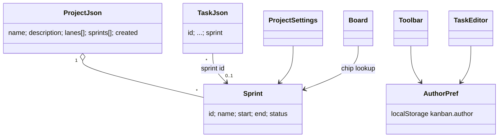
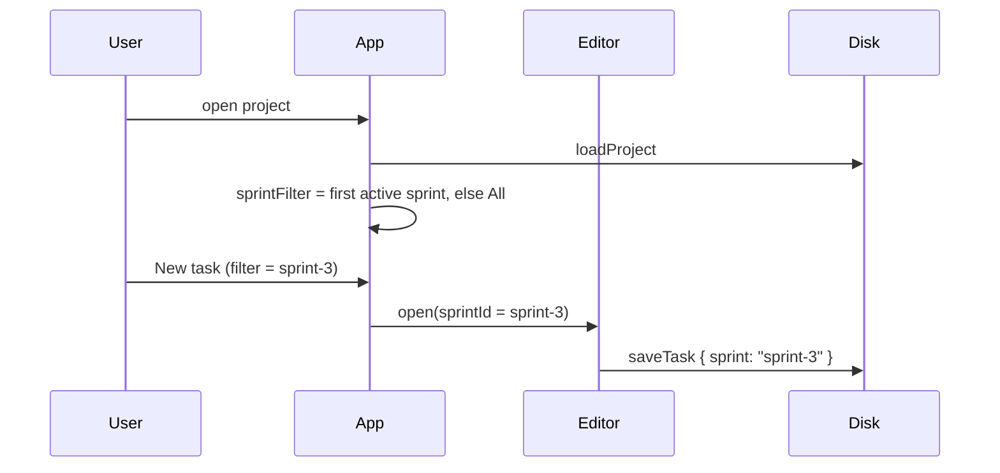
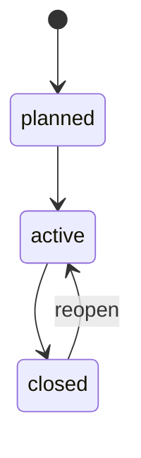

<!-- Created by Claude (claude-opus-5-5) -->
<!-- Date: 2026-09-28 -->

# Plan: Sprints and Author Preference

| Field | Value |
|---|---|
| Status | Implemented |
| Created | 2026-09-28 |
| Updated | 2026-09-28 |
| Proficiency | 8/10 |
| Engine | Plain HTML / CSS / JavaScript (classic scripts on `window.Kanban`) |
| Revisions | 0 (latest: none) |
| Summary | Adds per-project sprints (planned, active, closed) with a task field and board filter, plus a per-browser author name. |

## Revision Log

| ID | Date | Type | Change |
|---|---|---|---|
| (empty until first amendment) |

---

## Overview

Projects gain a `sprints` list in `project.json`. Each task holds one optional `sprint` id. The toolbar filters the board by sprint and defaults to the first active sprint when a project opens. Sprints are managed in Project settings. The comment author becomes a per-browser preference (localStorage, since Chrome keeps no cookies for `file://`) set on the landing page or through a "You: name" chip in the top bar, so the comment form no longer asks for it.

## Architecture

## Key Flows

### Open project and create a task in a sprint

### Sprint status

Status is a free choice in the settings dialog; the diagram shows the intended use.

## Components

### storage.js
Owns: normalization.
- `normalizeProject`: adds `sprints[]` of `{ id, name, start, end, status }` (extras kept). `status` falls back to `planned`; dates are `YYYY-MM-DD` or `""`.
- `normalizeTask`: adds `sprint: string` (`""` means no sprint), placed after `due`.

### util.js
- `getAuthor() -> string`: localStorage `kanban.author`, default `Alex`.
- `setAuthor(name)`: trims, ignores empty.

### app.js
- `state.sprintFilter`: `""` (all), `"__none"`, or a sprint id. Reset on project switch to the first active sprint.
- `matches(task)`: applies the sprint filter. Tasks with an unknown sprint id count as "No sprint".
- Author chip in the top bar: prompt to rename. Landing page name field saves on input.
- New task passes the filtered sprint to the editor.

### project-settings.js
- Sprints section: rows with name, start, end, status, delete. Delete disabled while tasks reference the sprint. New sprint ids are slugified and unique; ids stay stable on rename.

### task-editor.js
- Sprint select: None, planned and active sprints, and the task's current sprint even if closed.
- Comment form: author input removed; shows "Commenting as <name>" and uses `getAuthor()`.

### board.js
- Card shows a sprint chip when the task has a known sprint.

## Patterns Applied

| Pattern | Where | Why |
|---|---|---|
| (none) | | Plain data plus a filter; no coupling problem to solve. |

## Open Questions
- [ ] Sprint burndown or progress counts per sprint (out of scope for now).

## Implementation Notes
- Update README: `sprints` in `project.json`, `sprint` in task JSON, agent rule to use sprint ids from `project.json`.
- Update the example project with one active sprint.
- The sprint filter select is rebuilt on every render of project data, since sprints can change on disk.
