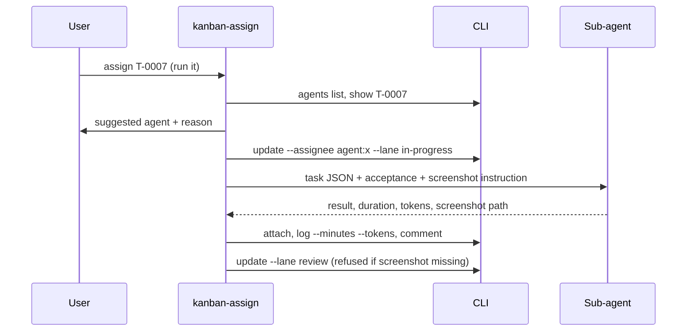
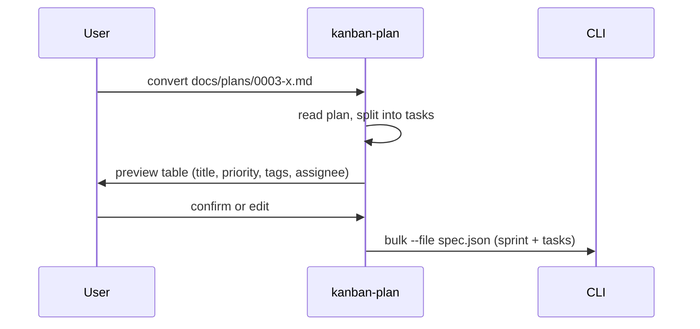

<!-- Created by Claude (claude-opus-5-5) -->
<!-- Date: 2026-09-28 -->

# Plan: Tag Colors, Assignees, Work Log and Board Skills

| Field | Value |
|---|---|
| Status | Implemented |
| Created | 2026-09-28 |
| Updated | 2026-09-28 |
| Proficiency | 8/10 |
| Engine | Plain HTML / CSS / JavaScript (classic scripts on `window.Kanban`), Node CLI, Claude Code skills |
| Revisions | 4 (latest: U-004) |
| Summary | Colored tags, a single assignee (person or sub-agent), a screenshot requirement, a time and token work log, a Node CLI over a project folder and four skills that drive it. |

## Revision Log

| ID | Date | Type | Change |
|---|---|---|---|
| U-001 | 2026-09-28 | Update | Skills locate the CLI through a per-project `KANBAN_HOME` environment variable. |
| U-002 | 2026-09-28 | Fix | Review fixes: strict flag parsing, `project` command, screenshot gate, sprint name reuse check, merged agents.json across repos, settings conflict check. |
| U-003 | 2026-09-28 | Update | One project per folder (default `<repo>/.kanban`): CLI drops the slug argument and gains `init`, `agents.json` sits beside `project.json` and holds one repo's agents, the browser lists recently opened folders. |
| U-004 | 2026-09-28 | Update | Skills live in the app repo (`skills/`); `tools/setup.mjs`, run by the global `setup-kanban` skill, copies them to `<repo>/.claude/skills/` and the CLI to `<repo>/.kanban/tool/`. `KANBAN_HOME` is no longer used. |

---

## Overview

Tags get a stable color from a hash of their name; Project settings can pin a palette color per tag. Each task gets one `assignee`: `""`, a person's name, or `agent:<name>`. The agent list comes from `agents.json` in the project folder, written by `tools/kanban.mjs agents refresh`, which scans user, project and enabled-plugin agents plus the built-ins. Tasks can require a screenshot, and carry a `work` log of minutes and tokens per entry. Four user-level skills (`kanban-add`, `kanban-plan`, `kanban-manage`, `kanban-assign`) call the CLI, which reuses `js/util.js` and `js/storage.js` so the browser and the CLI share one normalizer.

## Architecture

```mermaid
classDiagram
  class ProjectJson { lanes[]; sprints[]; labels map }
  class TaskJson { labels[]; assignee; screenshot; work[] }
  class WorkEntry { by; date; minutes; tokens; note }
  class AgentsJson { generated; agents[] }
  class Agent { name; source; description }
  class Storage { normalize; loadProject; saveTask; saveMedia; useBackend }
  class Browser { board; editor; settings; app }
  class CLI { tools/kanban.mjs }
  class Skills { kanban-add; kanban-plan; kanban-manage; kanban-assign }
  TaskJson "1" o-- "*" WorkEntry
  AgentsJson "1" o-- "*" Agent
  TaskJson --> Agent : assignee agent:name
  Browser --> Storage : folder or memory backend
  CLI --> Storage : node fs backend
  CLI --> AgentsJson : agents refresh
  Browser --> AgentsJson : read
  Skills --> CLI
```

## Data

- `project.json`: `labels: { "bug": "red" }`. Keys are tag names, values are palette keys: `red orange yellow green teal blue indigo purple pink gray`. Tags without an entry use the hash color.
- Task: `assignee` (string), `screenshot` (bool), `work` (array), in that key order after `sprint`, with `work` last.
- `work` entry: `{ "by": "code-reviewer", "date": "<iso>", "minutes": 12, "tokens": 48000, "note": "" }`.
- `agents.json` (project folder, beside `project.json`): `{ "generated": "<iso>", "agents": [{ "name": "feature-dev:code-reviewer", "source": "plugin feature-dev", "description": "..." }] }`. `name` is the exact `subagent_type` value.

## Key Flows

### Assign and run an agent



### Plan to sprint



## Components

### util.js
- `TAG_COLORS`: palette keys.
- `tagColor(name, labels) -> key`: pinned key if valid, else a stable hash pick.

### storage.js
- `normalizeProject`: `labels` object with valid palette values only.
- `normalizeTask`: `assignee`, `screenshot`, `work[]` (extras kept per entry).
- `useBackend(b)`: lets the CLI plug in a Node fs backend.
- `loadAgents() -> Agent[]`: reads `agents.json`, `[]` when missing or bad.

### board.js
- Tag chips use `tag-<color>` classes.
- Card meta: assignee chip (person or robot), screenshot badge (red while no image is attached), work totals.

### task-editor.js
- Assignee select: Unassigned, Me, the task's current assignee if unknown, then an "Agents" group from `agents.json` (hint when empty).
- "Requires screenshot" checkbox.
- Work log section: entries with remove, and an add row (minutes, tokens, note) using the author name.

### project-settings.js
- Tags section: each tag used by tasks or pinned, with a chip preview and a select (Auto or a palette key). Save writes only pinned entries.

### app.js
- `state.agents` loaded on start and Reload.
- Assignee filter: All, Me, Any agent, Unassigned, then each distinct assignee.

### tools/kanban.mjs
Loads `js/util.js` and `js/storage.js` into a `vm` context with a Node fs backend. Project folder: `--root`, else `KANBAN_ROOT`, else `.kanban` in the current directory. Output is plain text, `--json` for machine use.

| Command | Purpose |
|---|---|
| `init [--name]` | create the folder and its `project.json` |
| `project` | lane ids, sprint ids and statuses, tags in use, pinned colors |
| `list [--lane --sprint --assignee --label]` | filtered task table |
| `show <id>` | task JSON |
| `add --title ... [fields] [--bottom]` | new task at top of lane |
| `update <id> [fields]` | edit; a lane change goes to the top; review and the last lane require a screenshot when flagged |
| `comment <id> --text [--author]` | append comment, author defaults to Claude |
| `log <id> --minutes --tokens [--by --note]` | append work entry |
| `attach <id> --file [--name]` | copy file to media and reference it |
| `delete <id> --yes` | remove task and its media |
| `sprint add --name [...]` / `sprint set <id> [...]` | manage sprints |
| `bulk --file spec.json` | create an optional sprint and many tasks in listed order |
| `agents refresh [--cwd]` / `agents list` | write or read `agents.json` |
| `validate` | report bad files, unknown lanes, sprints and agents |

Field flags: `--title --description --lane --priority --labels a,b --due --sprint --assignee --screenshot true|false`.

### Skills (`skills/`, copied per project)
The global `setup-kanban` skill runs `tools/setup.mjs`. It copies these skills to `<repo>/.claude/skills/` and the CLI with `js/util.js` and `js/storage.js` to `<repo>/.kanban/tool/`, then creates the board when missing. Each skill runs `node .kanban/tool/kanban.mjs` from the repo root.

- `kanban-add`: create or edit one or more tasks.
- `kanban-plan`: plan file to a sprint plus tasks through a preview, then `bulk`.
- `kanban-manage`: list, move, comment, sprints, validate, delete (asks first).
- `kanban-assign`: suggest an agent from descriptions, set assignee, optionally run it and record work, screenshot and result.

## Patterns Applied

| Pattern | Where | Why |
|---|---|---|
| Adapter | storage backends (folder, memory, node fs) | CLI and browser share normalization and file rules through one interface. |

## Open Questions
- [ ] Per-sprint totals of minutes and tokens (out of scope for now).

## Implementation Notes
- Update README: new fields, `agents.json`, CLI usage, agent rules for screenshot and work log.
- Update the example project with an assignee, a pinned tag color and a work entry.
