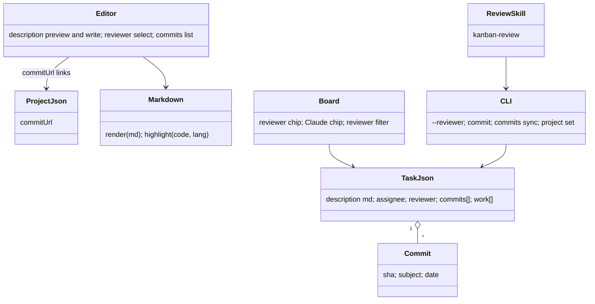
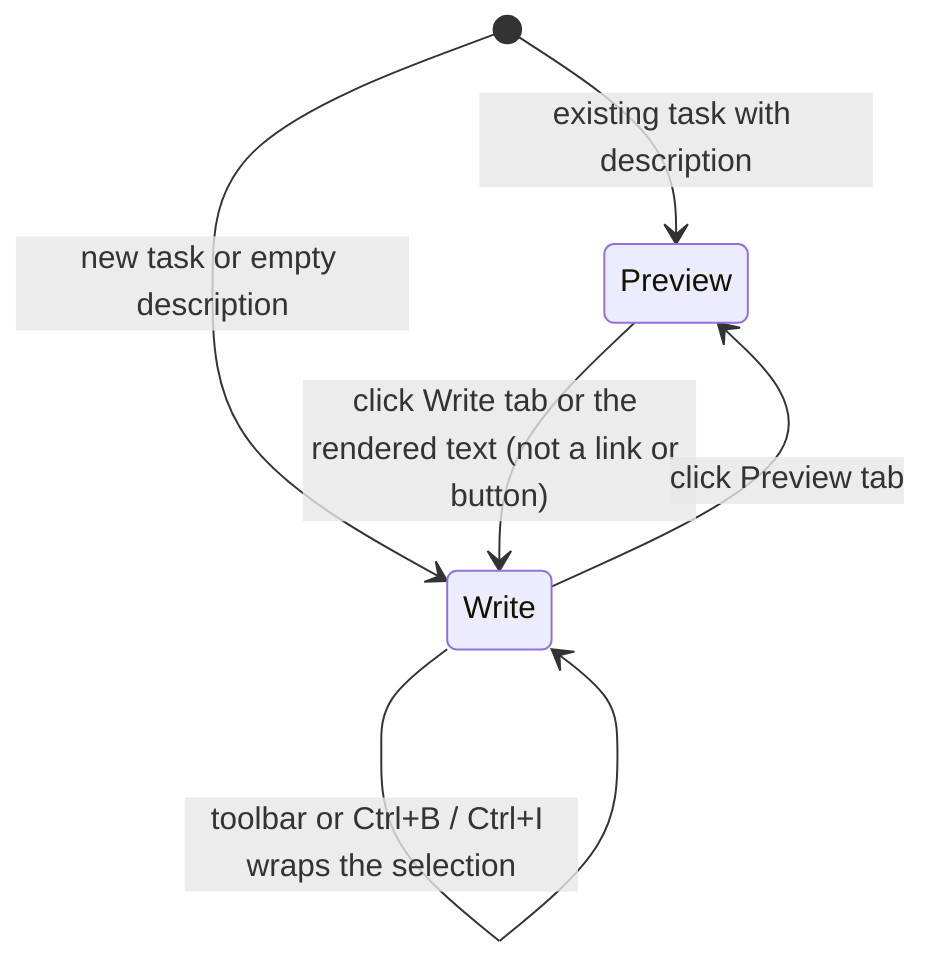
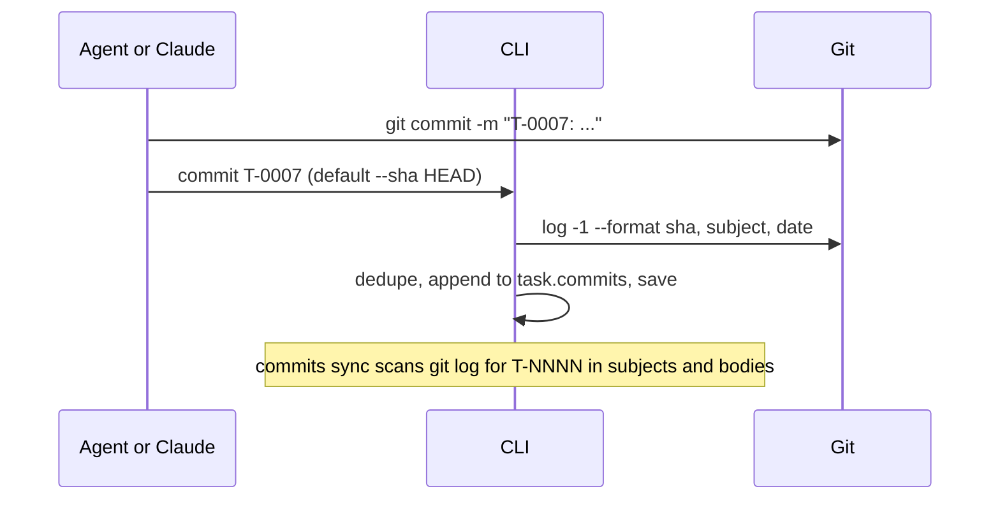

<!-- Created by Claude (claude-opus-5-5) -->
<!-- Date: 2026-09-30 -->

# Plan: Rich Text, Reviewer, Commits and Claude Assignee

| Field | Value |
|---|---|
| Status | Implemented |
| Created | 2026-09-30 |
| Updated | 2026-09-30 |
| Proficiency | 8/10 |
| Engine | Plain HTML / CSS / JavaScript (classic scripts on `window.Kanban`), Node CLI, Claude Code skills |
| Revisions | 0 (latest: none) |
| Summary | Markdown descriptions and comments with highlighted code blocks, a `reviewer` field, a `commits` field fed by the CLI, a reserved `claude` assignee for the main session, and a `kanban-review` skill. |

## Revision Log

| ID | Date | Type | Change |
|---|---|---|---|
| (empty until first amendment) |

---

## Overview

Descriptions and comments are Markdown strings rendered by a built-in, dependency-free renderer with a generic code highlighter. The editor shows the rendered description and switches to a Write tab with a formatting toolbar. Tasks gain `reviewer` (same values as `assignee`) and `commits` (SHA, subject, date). The CLI records commits from git and syncs them from task IDs in commit messages; a project `commitUrl` template turns them into links. The value `claude` names the main Claude session as an assignee or reviewer, so work runs inline without a sub-agent. The `kanban-review` skill reviews tasks in the review lane, posts findings, and moves them on the user's confirmation.

## Architecture



## Data

- Person values for `assignee` and `reviewer`: `""` (unassigned), a person's board name, `claude` (main session), or `agent:<name>` from `agents.json`.
- Task key order: `... sprint, assignee, reviewer, screenshot, links, attachments, comments, commits, work`. Old files gain `reviewer: ""` and `commits: []` on normalize.
- Commit: `{ "sha": "<7 to 40 lowercase hex>", "subject": "...", "date": "<iso or empty>" }`. Unique per task by SHA prefix match (a short and a full SHA of the same commit count as one; the longer one is kept).
- `project.json`: `commitUrl` string, for example `https://github.com/owner/repo/commit/{sha}`. Empty means commits render as plain text. Only `http(s)` values containing `{sha}` are kept.
- `description` and comment `text` stay plain strings holding Markdown. Existing plain-text descriptions render unchanged because single newlines become line breaks.

## Key Flows

### Edit a description



### Record commits



### Review

```mermaid
sequenceDiagram
  participant U as User
  participant R as kanban-review
  participant CLI
  participant S as Sub-agent (reviewer agent:*)
  U->>R: review the In review items
  R->>CLI: commits sync, list --lane review --json
  R->>R: reviewer claude or empty: self (set reviewer claude); agent:*: dispatch; person: skip and list
  loop each task
    R->>CLI: show id
    R->>R: git show each commit, else uncommitted diff (noted)
    R-->>S: task JSON + diffs + acceptance, when reviewer is agent:*
  end
  R->>U: verdict table (Approved / Changes requested + top findings), confirm once
  R->>CLI: comment (Markdown findings, --author reviewer), log --by reviewer --note review
  R->>CLI: update --lane <last lane> or in-progress
```

## Components

### js/markdown.js (new, browser only)
Responsibility: turn a Markdown string into DOM nodes safely. Builds every node with `K.util.el` and text nodes; never uses `innerHTML`.

- `render(md) -> DocumentFragment`
  - Blocks: ATX headings `#` to `######` (rendered `h4` to `h6`, deeper levels clamp to `h6`), paragraphs, fenced code (```` ``` ```` or `~~~`, optional language), lists `- * +` and `1.` with nesting by indent, task items `- [ ]` / `- [x]` as disabled checkboxes, blockquotes `>`, horizontal rule `---`.
  - Inline: `**bold**`, `*italic*` and `_italic_`, `~~strike~~`, `` `code` ``, `[text](url)`, bare `http(s)://` autolinks, backslash escapes. A single newline inside a paragraph becomes `<br>`.
  - Links: only `http:`, `https:` and `mailto:`; others render as text. Links open in a new tab with `rel="noopener"`.
- `highlight(code, lang) -> Node[]`: one tokenizer for strings, comments, numbers and keywords. The language picks the comment style (`//` and `/* */` for js, ts, cs, java, c, cpp, go, rust, css; `#` for py, sh, bash, ps1, yaml, toml; `--` for sql, lua; `<!-- -->` for html, xml) and a keyword set. Unknown or missing language: strings, numbers and both `//` and `#` comments, no keywords.
- Code block DOM: `div.code-block` holding a header row (language label, Copy button using `navigator.clipboard.writeText`, falling back to selecting the text) and a scrolling `pre > code` body.

Edge cases: an unclosed fence runs to the end of the text; HTML tags show literally; an empty string gives an empty fragment; very long lines scroll horizontally; tokens never cross line ends except block comments and template strings.

### util.js
- `CLAUDE = 'claude'` constant.
- `isAgentValue(v) -> bool`: `v === 'claude'` or starts with `agent:`.
- `assigneeLabel(v)`: `claude` gives `Claude`; `agent:x` gives `x`; others unchanged.
- `commitLink(template, sha) -> string`: template with `{sha}` replaced, or `''`.

### storage.js
- `normalizeTask`: `reviewer` string; `commits` array of `{ sha, subject, date }` with invalid SHAs dropped and duplicates merged.
- `normalizeProject`: `commitUrl` kept only when it is `http(s)` and contains `{sha}`.
- `addCommit(task, commit) -> bool`: dedupe by prefix, keep the longer SHA, return whether anything changed. Shared by the editor and the CLI.

### task-editor.js
- Description: a Preview / Write tab pair. Preview renders `markdown.render`, or a muted "No description. Click to add." Write shows the toolbar and the textarea.
- Toolbar: Bold, Italic, Inline code, Code block, Bullet list, Checklist, Link. `wrapSelection(before, after, placeholder)` wraps the selection or inserts the placeholder selected; line tools prefix each selected line. `Ctrl+B` and `Ctrl+I` work in the textarea.
- `personOptions(agents, current, me) -> Node[]`: Unassigned, `Me (<name>)`, `Claude (main session)`, the current value when unknown, then the Agents group. Used by both the Assignee and the Reviewer selects.
- Comments render through `markdown.render`; the comment box hint says Markdown is supported.
- Commits section: each row shows the short SHA (7), subject and date, linked via `commitLink` when set, with remove. The add row takes a SHA and an optional subject and rejects non-hex input.
- `collect` and the dirty snapshot include `reviewer`, `commits` and the add-row inputs.

### board.js and app.js
- Card chips: the assignee gets a person, robot or Claude icon; the reviewer gets its own chip with a review icon when set.
- Filters: the assignee filter gains `Claude`, and `Any agent` matches `claude` too. A new Reviewer filter has the same options.
- Search also matches `reviewer`.

### project-settings.js
- A "Commit URL" input with `{sha}` in the placeholder; save refuses an invalid value and keeps the dialog open.

### style.css
- Markdown content styles (headings, lists, quotes, inline code), `pre.code` with a header row, token colors `tok-str tok-com tok-num tok-kw` for light and dark themes, preview and write tabs, toolbar, and the reviewer chip.

### tools/kanban.mjs
Runs git through `execFileSync('git', args)` with `--cwd` (default the current directory) and no shell.

| Command | Change |
|---|---|
| field flags | `--reviewer <name \| claude \| agent:name>`, validated like `--assignee` (unknown agents refused without `--force`) |
| `list` | `--reviewer` filter; the table gains a reviewer column |
| `commit <id> [--sha <ref>] [--subject <s>]` | resolve `ref` (default `HEAD`) to sha, subject and date and add it; without git, requires `--subject` and a hex `--sha` |
| `commits sync [--since <ref or date>] [--all] [--dry-run]` | scan `git log` (current branch, or all with `--all`) for `T-\d+` in subjects and bodies; add missing commits to existing tasks; print added per task and unknown IDs |
| `project set [--name] [--commit-url]` | edit project fields |
| `validate` | also reports an unknown reviewer agent, a bad commit SHA and a bad `commitUrl` |

Edge cases: git missing or not a repository gives a clear error and exit code 1; a SHA prefix matching several commits is refused; `sync` never removes commits; IDs in commits that match no task are listed and ignored.

### Skills (`skills/`)
- `kanban-review` (new): select tasks in `review` (or the IDs or `--sprint` given). Tasks with reviewer `claude` or empty are reviewed inline and get reviewer `claude`; tasks with an `agent:*` reviewer are dispatched to that sub-agent with the task, diffs and acceptance criteria; tasks with a person as reviewer are listed as skipped. Evidence is the task's commits after `commits sync`, else the uncommitted diff (said in the review). The skill checks acceptance criteria, checklist items and the screenshot requirement. It presents one verdict table and asks once, then comments with `**Review: Approved**` or `**Review: Changes requested**` followed by findings, logs the review's time and tokens, and moves approved tasks to the last lane and the rest to `in-progress`.
- `kanban-assign`: `claude` means Claude does the task in the current session without a sub-agent and logs with `--by Claude`, as for other main-session work. Commit messages include the task ID, followed by `kanban commit <id>`.
- `kanban-add` and `kanban-plan`: `--reviewer` and the bulk `reviewer` field; descriptions are Markdown (checklists for acceptance criteria, fenced code with a language).
- `kanban-manage`: `commits sync`, `project set --commit-url`.

## Patterns Applied

| Pattern | Where | Why |
|---|---|---|
| Interpreter (small recursive-descent parser) | `markdown.js` blocks then inlines | Builds safe DOM directly from a fixed grammar subset. |
| Strategy (per-language comment and keyword tables) | `highlight` | One tokenizer serves every language through data tables. |
| Adapter (existing) | storage backends | Editor and CLI share `addCommit` and the normalizer. |

## Open Questions
- [ ] Markdown tables and images from task attachments (out of scope for now).
- [ ] Card preview of the first description line (out of scope for now).

## Implementation Notes
- Order: util and storage fields, then the CLI and its tests, then `markdown.js` and its styles, then the editor, board and settings, then the skills and README.
- Add `js/markdown.js` to `index.html` after `util.js`. It is browser only, so `setup.mjs` copies nothing new to `.kanban/tool/`; `setup.mjs` picks up `skills/kanban-review` automatically from the folder listing.
- Test the renderer in Node through the existing `vm` loader with a minimal `el` stub: headings, nested lists, an unclosed fence, `<script>` shown as text, and a `javascript:` link rendered as text.
- Update the example project with a Markdown description containing a code block, a reviewer and a commit.
- Update README: Markdown support, `reviewer`, `claude`, `commits`, `commitUrl`, the new CLI commands and `kanban-review`.
- After implementing, run `node tools/setup.mjs --target D:/Repos/Misc/Hiker --update` (with the user's confirmation) so Hiker gets the new CLI and skills.
