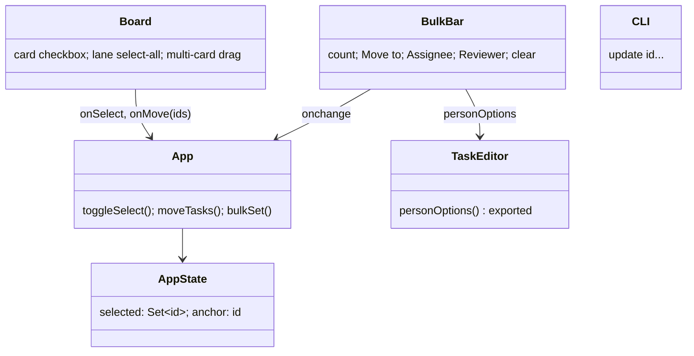
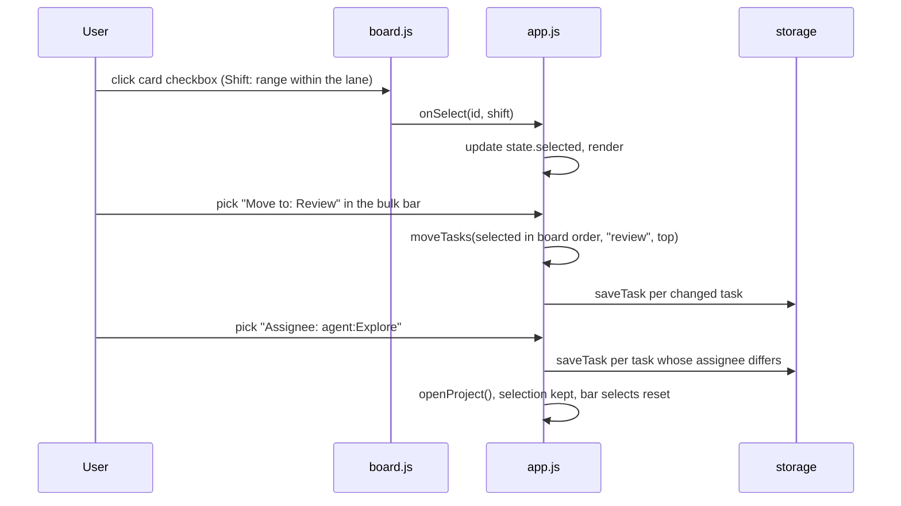
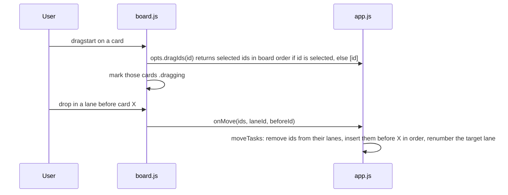

<!-- Created by Claude (claude-opus-5-5) -->
<!-- Date: 2026-09-30 -->

# Plan: Bulk Edit

| Field | Value |
|---|---|
| Status | Implemented |
| Created | 2026-09-30 |
| Updated | 2026-09-30 |
| Proficiency | 8/10 |
| Engine | Plain HTML / CSS / JavaScript (classic scripts on `window.Kanban`), Node CLI |
| Revisions | 0 (latest: none) |
| Summary | Gmail-style card checkboxes, a bulk bar that moves, assigns or sets the reviewer of the selected tasks at once, dragging a selection as one, and `update` taking several task ids in the CLI. |

## Revision Log

| ID | Date | Type | Change |
|---|---|---|---|
| (empty until first amendment) |

---

## Overview

Each card gets an always-visible checkbox and each lane header a "select visible" checkbox. While any card is selected, a bulk bar under the top bar shows the count and three selects (Move to, Assignee, Reviewer) that save on pick, plus a clear button. Dragging a selected card moves the whole selection to the drop point. The CLI `update` accepts several ids and applies the same fields to each, all or nothing.

## Architecture

## Data

No file format changes. Selection is page state only: `state.selected` (task ids) and `state.anchor` (last id clicked without Shift, for ranges). It is not saved and is cleared on folder switch.

## Key Flows

### Select and bulk set

### Drag a selection

## Components

### board.js
- `renderCard`: a checkbox (`input.card-check`, `aria-label` "Select T-0007") before the id. Its click calls `opts.onSelect(task.id, e.shiftKey)` and stops propagation, so the editor does not open and a drag does not start from it. The card gets class `selected` when `opts.selected.has(task.id)`.
- `renderLane`: a header checkbox, checked when every visible card is selected, indeterminate when some are. Click calls `opts.onSelectLane(visibleIds, checked)`.
- Drag: `draggingIds` (array) replaces `draggingId`. `dragstart` takes `opts.dragIds(task.id)` and marks each matching card `.dragging`; `placeMarker` and `beforeIdAtMarker` already skip `.dragging` cards. `ondrop` calls `opts.onMove(draggingIds, lane.id, beforeId)`.
- opts gains `selected`, `onSelect(id, shift)`, `onSelectLane(ids, on)`, `dragIds(id)`.

### app.js
- `boardOrder(ids) -> id[]`: sorts by lane index, then `byOrder`. Used for drags, "Move to" and ranges.
- `toggleSelect(id, shift)`: without Shift, toggles `id` and sets `anchor`. With Shift and an anchor in the same lane, selects every visible card between them; otherwise it behaves as a plain toggle.
- `selectLane(ids, on)`: adds or removes those ids.
- `moveTasks(ids, laneId, beforeId)` replaces `moveTask`: takes the moving tasks out, inserts them in the given order before `beforeId` (or at the end, or at the top when `beforeId` is `TOP`), sets their `lane`, renumbers the target lane 10, 20, 30... and saves only changed tasks. The old lanes keep their orders (gaps are fine).
- `bulkSet(key, value)` for `assignee` or `reviewer`: sets it on selected tasks whose value differs, bumps `updated`, saves in one `withWrite`.
- `renderBulkBar()`: hidden when nothing is selected. Selects start on a placeholder (`Move to...`, `Assignee...`, `Reviewer...`) and reset to it after each change. Lanes list `project.lanes`; people use `K.taskEditor.personOptions(state.agents, null)`.
- `render()` first prunes `state.selected` to ids of tasks visible under the current filters, so hidden or deleted tasks are never edited.
- Esc clears the selection when no dialog is open. `connectHandle` and `useMemory` clear it.

### task-editor.js
- Export `personOptions` on `K.taskEditor`. A `current` of `null` selects nothing.

### index.html and style.css
- `
` between the top bar and `#warnings`, with a count, three selects and a clear button (✕).
- Styles for `.card-check`, `.card.selected` (accent outline), the lane header checkbox and `.bulk-bar` (sticky, accent background token for light and dark).

### tools/kanban.mjs
- `update <id> [<id>...] [fields] [--bottom]`: ids are deduplicated; every id must exist. Fields apply to every task in memory and every check runs (unknown lane, agent, screenshot) before any file is written, so one error writes nothing.
- Lane change with several ids: the tasks land at the top of the new lane in their current board order (bottom with `--bottom`). Implemented by placing them in reverse order at the top, or forward order at the bottom, through `orderAt`.
- Output: one `Updated` line per task; `--json` prints an array when more than one id is given.
- Help text and the skills (`kanban-manage` table, `kanban-work` when it starts a group) mention the multi-id form.

## Edge cases
- Filters change while cards are selected: hidden cards drop out of the selection.
- A poll reloads the board: the selection survives by id; tasks that vanished drop out.
- Dragging an unselected card moves only that card and leaves the selection alone.
- Dropping a selection onto its own lane reorders it as a block.
- A bulk change that changes nothing (all already in that lane or assignee) writes nothing.
- The browser does not enforce the screenshot rule (unchanged); the CLI still does, for every id.

## Patterns Applied

| Pattern | Where | Why |
|---|---|---|
| Single source of truth (selection set in app state) | `state.selected` | Board and bulk bar render from one set that survives re-renders. |
| Generalization over duplication | `moveTasks` | One move routine serves single drag, multi drag and the bulk bar. |

## Implementation Notes
- Order: CLI multi-id update and tests, then `moveTasks`, then selection and checkboxes, then the bulk bar and styles, then skills and README.
- Browser checks: select via checkbox and Shift range, lane select-all, bulk move, assign and reviewer, multi-drag into another lane and within a lane, filter pruning, Esc, no console errors.
- After implementing, offer the Hiker and super-monkey updates with `setup.mjs --update`.
