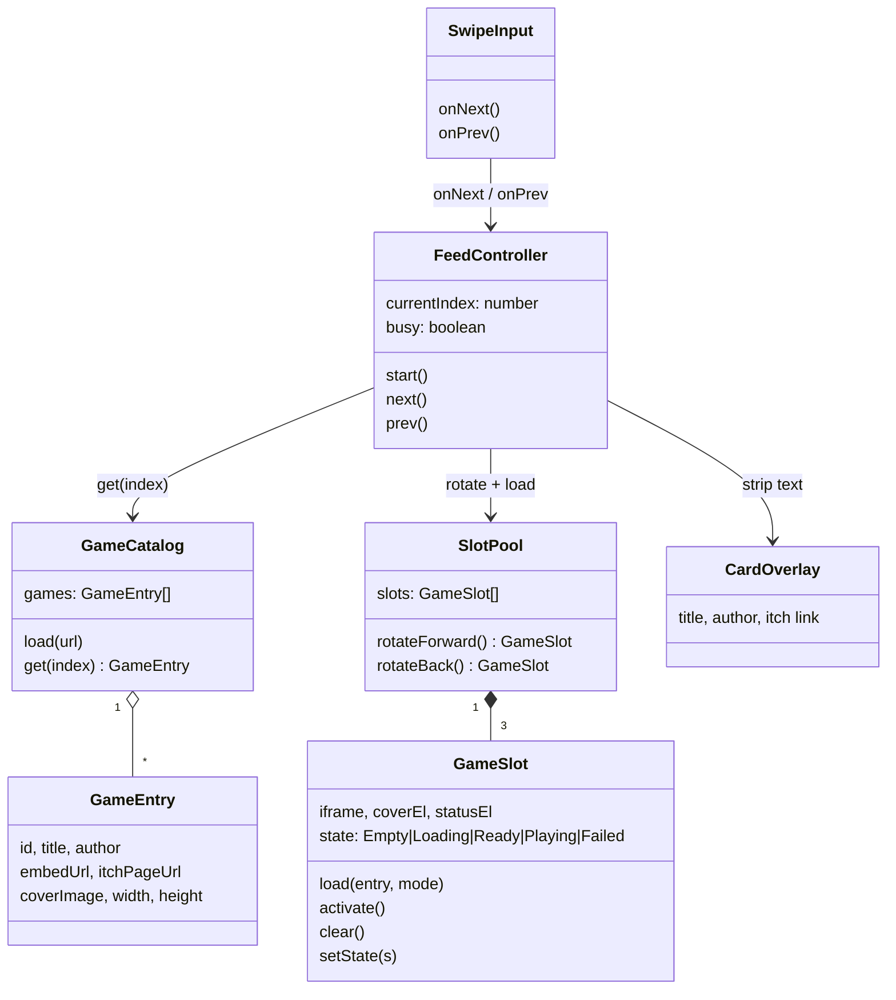
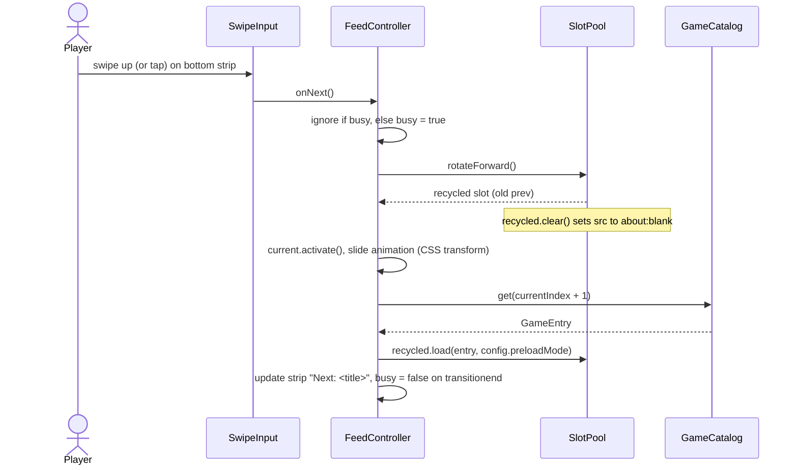
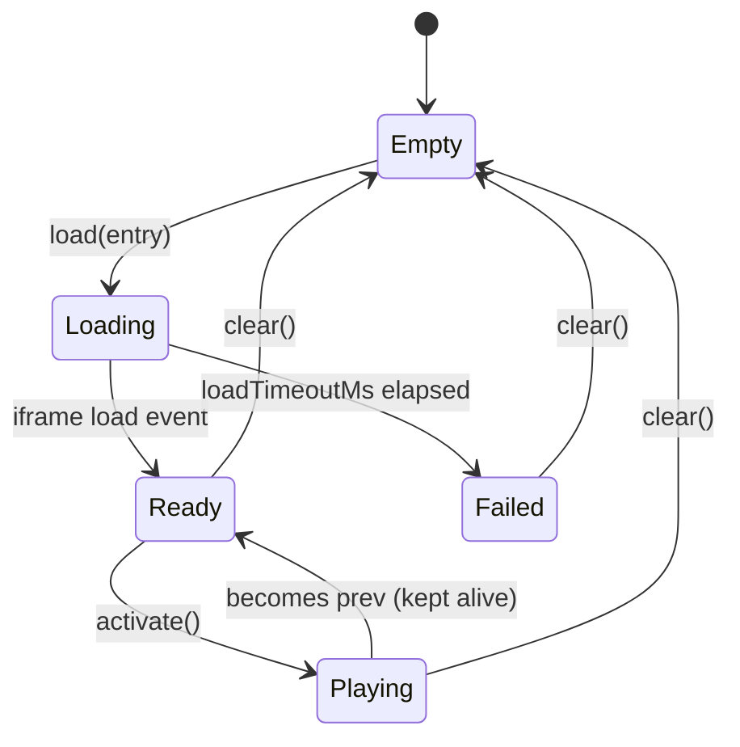

<!-- Created by Claude (claude-opus-5-5) -->
<!-- Date: 2026-10-05 -->

# Plan: Snackable Game Feed

| Field | Value |
|---|---|
| Status | In Progress |
| Created | 2026-10-05 |
| Updated | 2026-10-05 |
| Proficiency | 3/10 |
| Engine | HTML / CSS / vanilla JS (ES modules), hosted on GitHub Pages |
| Revisions | 5 (latest: U-005) |
| Summary | Mobile-first, TikTok-style vertical feed of seconds-long itch.io HTML5 games, with a swipe strip to move between them and the next game preloaded. |

## Revision Log

| ID | Date | Type | Change |
|---|---|---|---|
| U-005 | 2026-10-05 | Update | Moved into the web-apps repo as `apps/snackable/`, published at https://abr-designs.github.io/web-apps/snackable/ when merged to main. |
| U-004 | 2026-10-05 | Improvement | Credit (title, author, itch link) moved from a game overlay into the strip so it never covers game controls. Taps are under 10px of movement; drags between 10px and the swipe threshold are ignored. Steps 3-7 built. |
| U-003 | 2026-10-05 | Update | Show only games matching the device orientation; square-ish games (sides within 15%) fit both. Rotating keeps the current game. |
| U-002 | 2026-10-05 | Update | Default to stretching the iframe over the stage; most listed games are landscape and crop in portrait (new open question). |
| U-001 | 2026-10-05 | Fix | Play games through `itch.io/embed-upload/<uploadId>`; raw `html-classic.itch.zone` URLs show itch.io's anti-hotlink page when framed. Curate with `tools/curate.mjs`. |

---

## Overview

Snackable presents one tiny itch.io game at a time, full screen, on an Android phone. The player plays for a few seconds, then swipes up on a bottom strip to get the next game instantly, or swipes down to resume the previous one. Games come from a hand-curated `data/games.json` built from itch.io's "seconds + touchscreen + HTML5" listing. The app is plain static files (no build step) served from GitHub Pages over HTTPS.

### Decisions

| Topic | Decision | Reason |
|---|---|---|
| Game source | Curated `data/games.json`, generated by `node tools/curate.mjs` (RSS feed, fallback `tools/sources.txt`) | itch.io has no CORS/API for listings and sits behind a Cloudflare bot check. Only `platform-web` (HTML5) games run in a browser; `platform-android` games are APK downloads. |
| Listing to curate from | `https://itch.io/games/duration-seconds/html5/input-touchscreen/platform-android` | HTML5 games that also target Android, so touch input is likely supported. |
| Navigation | Bottom swipe strip (~56px) showing "Next: <title>" | A game iframe captures every touch on it; the parent page cannot see those touches. The strip gives the feed its own touch area. |
| Preloading | `config.preloadMode`: `live` (default) or `light` | `live` gives instant swaps but the hidden game runs (audio, timers). `light` starts each game fresh with a short load. Compare both on device. |
| Going back | Resume previous game as left | Free with a 3-slot pool, matches TikTok feel. |
| Order | Shuffle once per session, loop at end | Variety without repeats until the list is exhausted. |
| Hosting | web-apps repo (`apps/snackable/`), GitHub Pages at https://abr-designs.github.io/web-apps/snackable/ after merge to main; VS Code Live Server for local checks | HTTPS, no npx, phone opens a plain URL. |
| Embed URL | `https://itch.io/embed-upload/<uploadId>?color=111111` | itch.io's official embed page. Adds a small itch.io credit bar and avoids the anti-hotlink page. |
| Orientation | Only games matching the device orientation (`matchMedia("(orientation: portrait)")`); sides within `SQUARE_TOLERANCE` 1.15 fit both | Avoids cropping. On rotate the current game keeps running and later picks use the new orientation. |
| Game sizing | Stretch iframe to the stage | The embed page and most engines scale themselves; CSS-scaling the native size overflowed. |

## Architecture



## Key Flows

### Swipe to next game



### Swipe back

Mirror of the flow above using `rotateBack()` and `catalog.get(currentIndex - 1)`. At `currentIndex === 0` play a short bounce animation and do nothing else.

### GameSlot state machine



In `light` mode, `load()` shows the cover and adds a prefetch hint; the slot goes to `Loading` only when `activate()` sets `iframe.src`.

## Components

### GameCatalog (`js/catalog.js`)
Responsibility: load and order the game list.
Owns: shuffled `GameEntry[]`.

Methods:
- `load(url) -> Promise<void>`: fetch `games.json`, shuffle once (Fisher-Yates). On failure show "Couldn't load games".
- `get(index) -> GameEntry`: returns `games[index % games.length]` from the orientation-filtered list, so the feed loops.
- `setOrientation(isPortrait)`: refilters on `orientation` change. Already loaded slots keep their games; only new loads use the new list.

### GameSlot (`js/slotPool.js`)
Responsibility: host one game iframe plus its cover, loading spinner, error message and credit overlay.
Owns: one `<iframe>`, current `GameEntry`, `state`.
Pattern: State (simple), every transition goes through `setState()`.

Methods:
- `load(entry, mode)`: `live` sets `iframe.src = entry.embedUrl` and starts the timeout timer. `light` shows the cover and adds `<link rel="prefetch" href=entry.embedUrl>`.
- `activate()`: `live` reveals the already running game. `light` sets `iframe.src` now.
- `clear()`: `iframe.src = "about:blank"`, cancels the timer, hides overlays, `setState("Empty")`.
- `setState(s)`: stores state, toggles spinner / "Couldn't load, swipe to skip" UI, logs the change to the console.

iframe attributes: `allow="autoplay; fullscreen; gamepad"`, `allowfullscreen`, `scrolling="no"`, `loading="eager"`.

### SlotPool (`js/slotPool.js`)
Responsibility: keep a fixed set of slots and assign roles prev / current / next.
Owns: `GameSlot[config.slotCount]` (default 3).
Pattern: Object Pool, iframes are recycled and never destroyed.

Methods:
- `rotateForward() -> GameSlot`: prev becomes the new next (after `clear()`), current becomes prev, next becomes current. Returns the recycled slot.
- `rotateBack() -> GameSlot`: mirror of `rotateForward()`.
- Positions slots with CSS classes `.slot--prev`, `.slot--current`, `.slot--next` (translateY -100%, 0, 100%).

### FeedController (`js/feed.js`)
Responsibility: track the current index and coordinate catalog, pool and UI.
Owns: `currentIndex`, `busy` flag.

Methods:
- `start()`: load index 0 into current and activate it, load index 1 into next, update the strip.
- `next()`: ignore if `busy`. `currentIndex++`, rotate, activate, load the recycled slot with `get(currentIndex + 1)`, update strip.
- `prev()`: ignore if `busy`. At index 0 bounce. Otherwise `currentIndex--`, rotate back, activate, load recycled slot with `get(currentIndex - 1)`.

### SwipeInput (`js/swipe.js`)
Responsibility: turn gestures on the bottom strip into navigation.
Owns: pointer start position.

Behaviour:
- `pointerdown` records Y. `pointerup` compares: moved up more than `config.swipeThresholdPx` (50) calls `onNext()`, moved down more than the threshold calls `onPrev()`, under 10px is a tap and calls `onNext()`, anything between is ignored.
- Strip CSS: `touch-action: none; overscroll-behavior: none;` to stop Android pull-to-refresh and page scroll.

### Credit (part of the strip)
The left side of the strip shows the current game's title, author and a link to `itchPageUrl` (new tab), so creators get credit and traffic without covering any game controls. The right side shows "Next ↑" and the next title. `SwipeInput` ignores pointers that start on the link.

### config.js

```js
export const config = {
  preloadMode: "live",      // "live" | "light"
  slotCount: 3,             // 3 = prev, current, next. 4 = two ahead.
  loadTimeoutMs: 10000,
  swipeThresholdPx: 50,
  transitionMs: 250,
  gamesUrl: "data/games.json",
};
```

### games.json entry

```json
{
  "id": "1234567",
  "title": "Tiny Tap",
  "author": "someone",
  "embedUrl": "https://itch.io/embed-upload/1234567?color=111111",
  "itchPageUrl": "https://someone.itch.io/tiny-tap",
  "coverImage": "https://img.itch.zone/....png",
  "width": 360,
  "height": 640
}
```

`tools/curate.mjs` fills every field: it reads the upload id from the `html-classic.itch.zone/html/<uploadId>/` URL in the game page, and title, author and cover from the page's `data.json`. Pages without an HTML5 upload are skipped.

## Patterns Applied

| Pattern | Where | Why |
|---|---|---|
| Object Pool | SlotPool -> GameSlot | Creating and destroying iframes is slow and leaks memory on Android. |
| State (simple) | GameSlot.setState | One place to drive spinner / error UI and logging. |
| Callback (Observer-lite) | SwipeInput -> FeedController | SwipeInput stays independent of the feed. |

## Open Questions
- [x] Do itch.io games load inside an iframe on another site? Yes through `embed-upload`, verified on localhost. Recheck on GitHub Pages and on the phone.
- [ ] Rotation on a real phone: the preview's viewport emulation fires no `change` event, so `refreshAhead()` is only verified by reading the code.
- [ ] Does `live` preload cause noticeable audio bleed or spoiled timers? Compare against `light` on device.
- [ ] Portrait pool is 44 of 162 games (19 portrait, 25 square) after reading 3 RSS pages from 2 listings. Raise `--pages` or add listings if the portrait feed still repeats too soon.
- [ ] itch.io terms and creator consent for embedding, before anything goes beyond a private prototype.

## Implementation Notes

Build order (each step testable on the phone via GitHub Pages):

1. **Embed spike.** Done: `spike.html` loads any game from `data/games.json` with a picker and a fit toggle. Push to Pages and open on Android.
2. **Curate data.** Done: `node tools/curate.mjs` wrote 162 games (`--pages N`, `--refresh`, extra listing URLs as arguments; already curated games are reused). Prune games that are not snackable or need keyboard/mouse.
3. **Static layout.** Done. `index.html` + `css/style.css`: full-height feed (`100dvh`), three stacked slots, bottom strip.
4. **GameCatalog + one GameSlot.** Done. Show the first game with loading and timeout states.
5. **SlotPool + FeedController.next().** Done. Forward navigation with slide animation.
6. **SwipeInput + prev().** Done. Gestures, resume previous, bounce at start.
7. **light mode.** Done, verified in the preview; compare on device. Implement and compare against `live`.

Gotchas:
- Use `100dvh` for height; `100vh` on Android Chrome includes the hidden URL bar area.
- Add `<meta name="viewport" content="width=device-width, initial-scale=1, viewport-fit=cover">`.
- Autoplay audio inside iframes usually needs a tap inside the game first; this is expected.
- Every new `.js` / `.css` file gets the attribution header.
