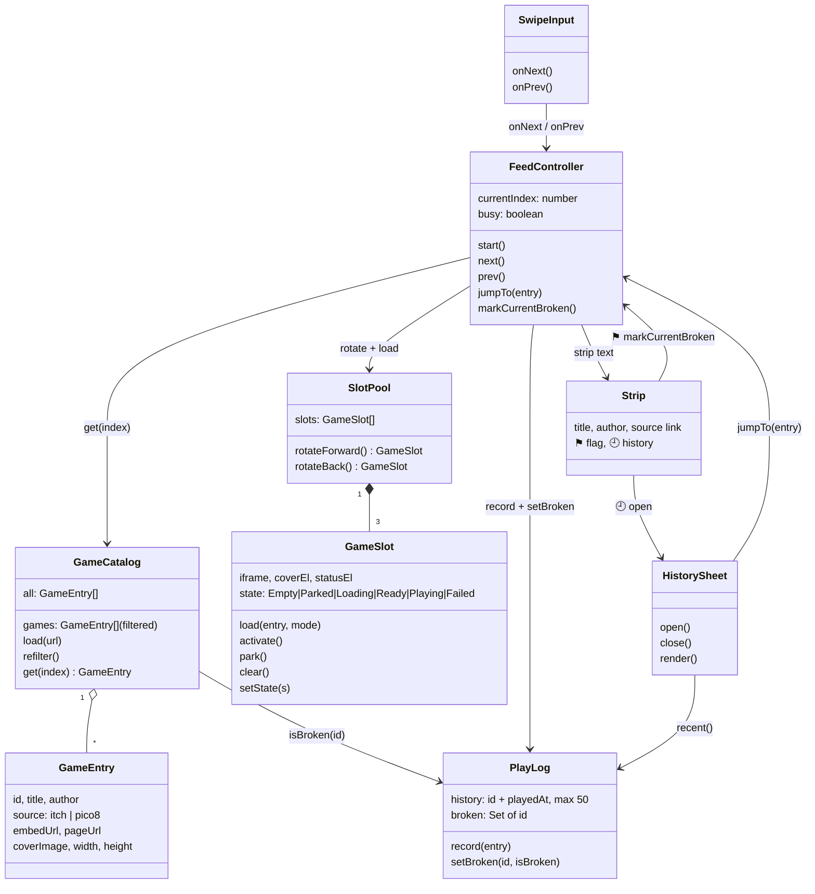
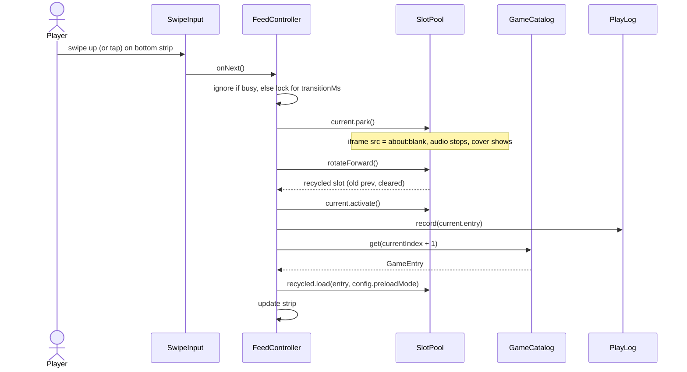
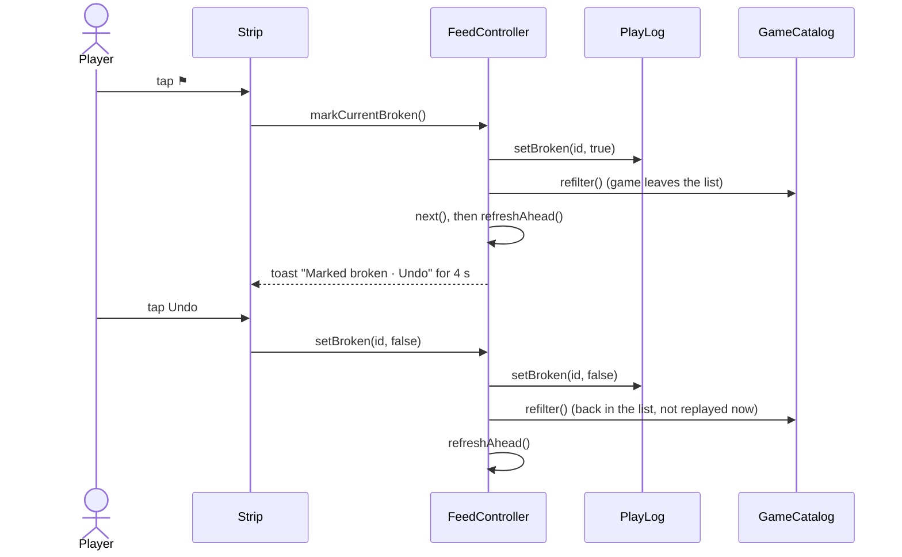
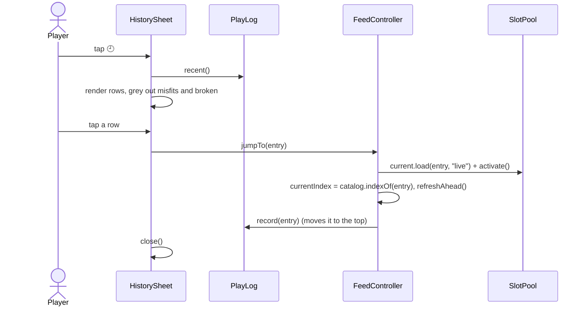
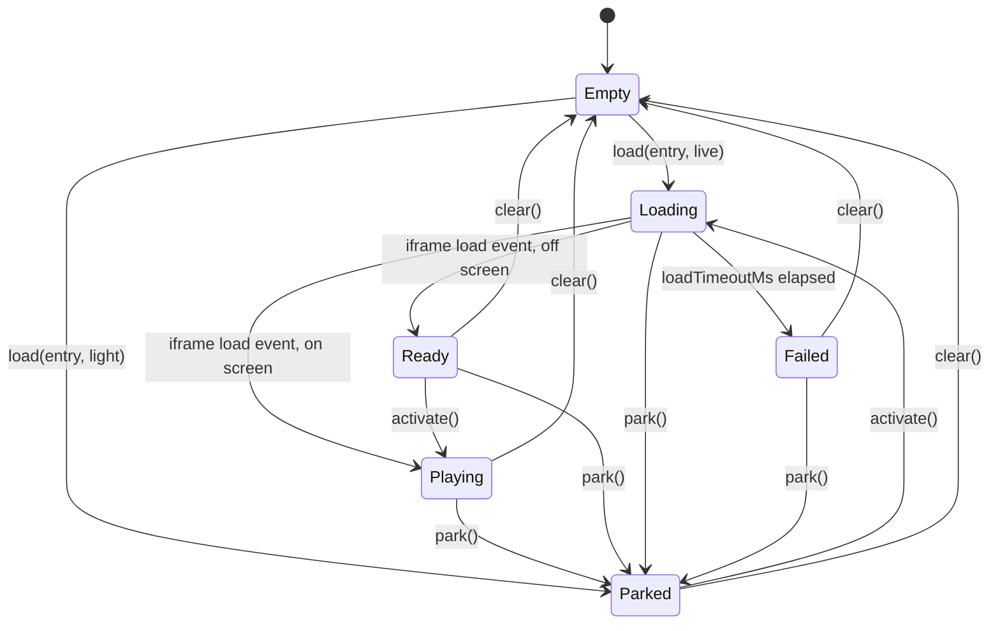

<!-- Created by Claude (claude-opus-5-5) -->
<!-- Date: 2026-10-05 -->

# Plan: Snackable Game Feed

| Field | Value |
|---|---|
| Status | In Progress |
| Created | 2026-10-05 |
| Updated | 2026-10-05 |
| Proficiency | 3/10 |
| Engine | HTML / CSS / vanilla JS (ES modules), hosted on GitHub Pages |
| Revisions | 9 (latest: U-009) |
| Summary | Mobile-first, TikTok-style vertical feed of seconds-long itch.io HTML5 games and PICO-8 carts, with a swipe strip to move between them, the next game preloaded, a play history and a way to mark broken games. |

## Revision Log

| ID | Date | Type | Change |
|---|---|---|---|
| U-009 | 2026-10-05 | Update | The database and likes / favorites todos are designed in plan 0002 (Supabase shared data). |
| U-008 | 2026-10-05 | Improvement | Steps 8-12 built. Swiping back loads the new previous slot parked (cover only), so no game runs above the current one. Undo and History's ⚑ toggle share `FeedController.setBroken(id, isBroken)`. PICO-8 covers use the post's `og:image`. 217 games (22 PICO-8 carts). |
| U-007 | 2026-10-05 | Update | Added two todos under Implementation Notes: explore a database for a shared global game list, and likes / favorites. |
| U-006 | 2026-10-05 | Update | Only the current game plays: a game leaving the screen is parked (iframe stopped, cover kept) and restarts on return. Adds marking games broken (strip ⚑ with undo, stored on the phone, exported to `tools/blocklist.txt`), a History sheet (last 50, tap to replay), and PICO-8 carts from the Lexaloffle BBS plus itch.io's pico-8 tag. Steps 8-12 planned. |
| U-005 | 2026-10-05 | Update | Moved into the web-apps repo as `apps/snackable/`, published at https://abr-designs.github.io/web-apps/snackable/ when merged to main. |
| U-004 | 2026-10-05 | Improvement | Credit (title, author, itch link) moved from a game overlay into the strip so it never covers game controls. Taps are under 10px of movement; drags between 10px and the swipe threshold are ignored. Steps 3-7 built. |
| U-003 | 2026-10-05 | Update | Show only games matching the device orientation; square-ish games (sides within 15%) fit both. Rotating keeps the current game. |
| U-002 | 2026-10-05 | Update | Default to stretching the iframe over the stage; most listed games are landscape and crop in portrait (new open question). |
| U-001 | 2026-10-05 | Fix | Play games through `itch.io/embed-upload/<uploadId>`; raw `html-classic.itch.zone` URLs show itch.io's anti-hotlink page when framed. Curate with `tools/curate.mjs`. |

---

## Overview

Snackable presents one tiny game at a time, full screen, on an Android phone. The player plays for a few seconds, then swipes up on a bottom strip to get the next game instantly, or swipes down to go back to the previous one, which restarts. Games come from a hand-curated `data/games.json` built from itch.io's "seconds + touchscreen + HTML5" listings and hand-picked PICO-8 carts from the Lexaloffle BBS. A ⚑ button marks a game as broken so it never shows again, and a 🕘 History sheet lists recently played games. The app is plain static files (no build step) served from GitHub Pages over HTTPS.

### Decisions

| Topic | Decision | Reason |
|---|---|---|
| Game source | Curated `data/games.json`, generated by `node tools/curate.mjs` (RSS feed, fallback `tools/sources.txt`) | itch.io has no CORS/API for listings and sits behind a Cloudflare bot check. Only `platform-web` (HTML5) games run in a browser; `platform-android` games are APK downloads. |
| Listing to curate from | `https://itch.io/games/duration-seconds/html5/input-touchscreen/platform-android`, plus `https://itch.io/games/duration-seconds/html5/tag-pico-8` | HTML5 games that also target Android, so touch input is likely supported. The pico-8 tag reuses the same pipeline. |
| PICO-8 carts | Hand-picked Lexaloffle BBS posts in `tools/sources-pico8.txt`, played through `https://www.lexaloffle.com/bbs/widget.php?pid=<cart_id>` | The BBS has no "seconds long" filter and its RSS only lists the newest carts, so picks are manual (tiny-game jams such as PICO-1k are a good seed). The widget is Lexaloffle's own player and sends no frame-blocking headers. Carts are 128x128, so they fit both orientations. |
| Navigation | Bottom swipe strip (~56px) showing "Next: <title>" | A game iframe captures every touch on it; the parent page cannot see those touches. The strip gives the feed its own touch area. |
| Preloading | `config.preloadMode`: `live` (default) or `light` | `live` gives instant swaps but the hidden next game runs (audio, timers). `light` starts each game fresh with a short load. Kept `live` in U-006; check on device whether the next game is audible. |
| Going back | Previous game restarts from the beginning | Every game leaving the screen is parked (iframe set to `about:blank`), so only the current game makes sound. The slot keeps the entry and cover, so going back is still one slot rotation. |
| Broken games | ⚑ in the strip marks the current game, skips to the next and offers Undo for 4 s. Marks live in `localStorage`; History's "Copy broken list" exports ids for `tools/blocklist.txt` | No server, so the phone cannot edit `games.json`. The export lets `curate.mjs` drop broken games for everyone. |
| History | 🕘 in the strip opens a full-screen sheet: last 50 games played, newest first, tap a row to play it again. Rows that do not fit the current orientation, or are marked broken, are greyed out | A game counts as played when it becomes the current game. Greying out keeps `jumpTo()` inside the filtered list, so the feed index always re-anchors. |
| Order | Shuffle once per session, loop at end | Variety without repeats until the list is exhausted. |
| Hosting | web-apps repo (`apps/snackable/`), GitHub Pages at https://abr-designs.github.io/web-apps/snackable/ after merge to main; VS Code Live Server for local checks | HTTPS, no npx, phone opens a plain URL. |
| Embed URL | itch.io: `https://itch.io/embed-upload/<uploadId>?color=111111`. PICO-8: `https://www.lexaloffle.com/bbs/widget.php?pid=<cart_id>` | Each site's official embed page. itch.io's avoids the anti-hotlink page and adds a small credit bar. |
| Orientation | Only games matching the device orientation (`matchMedia("(orientation: portrait)")`); sides within `SQUARE_TOLERANCE` 1.15 fit both | Avoids cropping. On rotate the current game keeps running and later picks use the new orientation. |
| Game sizing | Stretch iframe to the stage | The embed page and most engines scale themselves; CSS-scaling the native size overflowed. |

## Architecture



`PlayLog` is the only code that touches `localStorage`. Every other part goes through it, so the storage keys and the 50-entry cap live in one place.

## Key Flows

### Swipe to next game



### Swipe back

Mirror of the flow above using `rotateBack()` and `catalog.get(currentIndex - 1)`. The current game is parked first and becomes the next slot, so it does not keep playing hidden. The previous slot is already parked, so `activate()` restarts it. At the first game play a short bounce animation and do nothing else.

### Mark broken + undo



### History jump



The previous slot is left as it was, so swiping back after a jump returns to the game played before the jump.

### GameSlot state machine



`Parked` means "entry and cover kept, no game running". It replaces the old `light`-mode case where a loaded slot sat in `Empty` with its cover showing.

## Components

### GameCatalog (`js/catalog.js`)
Responsibility: load and order the game list.
Owns: shuffled `GameEntry[]`, the filtered list, the current orientation.

Methods:
- `load(url) -> Promise<void>`: fetch `games.json`, shuffle once (Fisher-Yates). On failure show "Couldn't load games".
- `get(index) -> GameEntry`: returns `games[index % games.length]` from the filtered list, so the feed loops.
- `setOrientation(isPortrait)`: stores the orientation and calls `refilter()`.
- `refilter()`: rebuilds the filtered list as "fits the orientation and is not marked broken". Already loaded slots keep their games; `FeedController.refreshAhead()` fixes the ahead slots.
- `find(id) -> GameEntry | null`: looks up any entry by id, used to turn History ids back into entries.

Stub:
```js
export class GameCatalog {
  #all = [];          // shuffled, every game
  #games = [];        // filtered: fits orientation and not broken
  #isPortrait = true;
  #squareTolerance;
  #playLog;           // read-only use: isBroken(id)

  constructor(squareTolerance, playLog) {}
  async load(url) {}            // fetch + shuffle; call setOrientation() after
  setOrientation(isPortrait) {} // store, then refilter()
  refilter() {}                 // #games = #all.filter(fits && !broken)
  fits(game) {}                 // unchanged
  find(id) {}                   // search #all, null when unknown (game removed from games.json)
  get(index) {}                 // unchanged, wraps both ways
  indexOf(entry) {}             // unchanged, -1 when filtered out
  get size() {}
}
```

### GameSlot (`js/slotPool.js`)
Responsibility: host one game iframe plus its cover, loading text and error message.
Owns: one `<iframe>`, current `GameEntry`, `state`.
Pattern: State (simple), every transition goes through `setState()`.

Methods:
- `load(entry, mode)`: `live` sets `iframe.src = entry.embedUrl` and starts the timeout timer. `light` shows the cover, adds `<link rel="prefetch" href=entry.embedUrl>` and sets `Parked`.
- `activate()`: starts the game if it is not running (`Parked`), otherwise reveals the already running game.
- `park()`: new. Stops the game (`iframe.src = "about:blank"`, timer cancelled) but keeps `entry` and shows the cover. No-op when the slot is `Empty`.
- `clear()`: everything `park()` does, plus forgets the entry, then `setState("Empty")`.
- `setState(s)`: stores state, toggles cover and status UI, logs the change to the console.

Stub:
```js
export class GameSlot {
  entry = null;
  state = "Empty";   // Empty | Parked | Loading | Ready | Playing | Failed
  el;

  load(entry, mode) {} // live: #start(); light: cover + prefetch, Parked
  activate() {}        // Parked -> #start(); Ready -> Playing
  park() {}            // stop iframe, keep entry, show cover, Parked
  clear() {}           // park() + drop entry and prefetch, Empty
  setOffset(offset, instant) {} // unchanged
  setState(state) {}   // Parked shows the cover
}
```

iframe attributes: `allow="autoplay; fullscreen; gamepad; accelerometer; gyroscope"`, `scrolling="no"`.

### SlotPool (`js/slotPool.js`)
Responsibility: keep a fixed set of slots and assign roles prev / current / next.
Owns: `GameSlot[config.slotCount]` (default 3).
Pattern: Object Pool, iframes are recycled and never destroyed.

Methods:
- `rotateForward() -> GameSlot`: prev becomes the new next (after `clear()`), current becomes prev, next becomes current. Returns the recycled slot.
- `rotateBack() -> GameSlot`: mirror of `rotateForward()`.
- Positions slots with `translateY` offsets (-100%, 0, 100%); the recycled slot jumps without animating.

### FeedController (`js/feed.js`)
Responsibility: track the current index and coordinate catalog, pool, play log and strip.
Owns: `currentIndex`, `busy` flag.

Methods:
- `start()`: load index 0 into current and activate it, load index 1 into next, record the first play, update the strip.
- `next()`: ignore if `busy`. Park current, `currentIndex++`, rotate, activate, record, load the recycled slot with `get(currentIndex + 1)`, update strip.
- `prev()`: ignore if `busy`. At the first game bounce. Otherwise park current, `currentIndex--`, rotate back, activate, record, load the recycled slot with `get(currentIndex - 1)`.
- `refreshAhead()`: unchanged. Re-anchors the index to the current game and reloads ahead slots that no longer match.
- `jumpTo(entry)`: new. Only called with an entry that is in the filtered list. Loads it into the current slot and activates it, re-anchors the index, refreshes ahead slots, records the play.
- `markCurrentBroken() -> id`: new. Marks, refilters, moves to the next game. Returns the id for the Undo toast.
- `setBroken(id, isBroken)`: new. Used by Undo and History's ⚑ toggle. Sets or clears the mark, refilters, refreshes ahead slots. A game marked this way keeps playing if it is current.

Stub:
```js
export class FeedController {
  #catalog; #pool; #strip; #config;
  #playLog;          // record(entry), setBroken(id, isBroken)
  #index = 0;
  #busy = false;

  constructor(catalog, pool, strip, config, playLog) {}
  start() {}
  next() {}                // + current.park() before rotating, + playLog.record()
  prev() {}                // + current.park() before rotating, + playLog.record()
  refreshAhead() {}        // unchanged
  jumpTo(entry) {}         // current.load(entry, "live"), activate(), re-anchor, refreshAhead(), record()
  markCurrentBroken() {}   // setBroken(true), catalog.refilter(), next(), refreshAhead(); returns id
  setBroken(id, isBroken) {} // playLog.setBroken(), catalog.refilter(), refreshAhead()
}
```

Edge case: marking the last game that fits leaves the filtered list empty. `next()` already returns early when `catalog.size === 0`, so the marked game stays on screen and the strip shows "None fit this orientation".

### PlayLog (`js/playLog.js`, new)
Responsibility: remember what was played and what is broken, on this phone.
Owns: `localStorage` keys `snackable.history` (array of `{ id, playedAt }`, newest first, max 50) and `snackable.broken` (array of ids).

Every read and write is wrapped in `try/catch`; when storage is unavailable (private window, blocked site data) the log keeps working in memory for the session.

Stub:
```js
export class PlayLog {
  #history = [];       // [{ id, playedAt }] newest first
  #broken = new Set();

  constructor(maxHistory) {} // loads both keys, ignores bad JSON
  record(entry) {}           // remove any older row for entry.id, add on top, trim to max, save
  recent() {}                // copy of #history
  isBroken(id) {}
  setBroken(id, isBroken) {} // add or remove, save
  brokenIds() {}             // sorted array, for "Copy broken list"
}
```

### HistorySheet (`js/historySheet.js`, new)
Responsibility: show recently played games over the feed and let the player replay or flag one.
Owns: the sheet element (`<section id="history" hidden>` in `index.html`) and its open/closed state.

Each row shows cover, title, author and time played ("3 min ago"). Row actions: tap the row to play it (greyed out when it does not fit the orientation or is broken), ⚑ toggle, source link (itch.io or Lexaloffle). The header has "Copy broken list" (writes ids one per line with `navigator.clipboard.writeText`) and a close button. The Android back gesture closes the sheet (push a history state on open, close on `popstate`).

Stub:
```js
export class HistorySheet {
  #el;
  #playLog;
  #catalog;   // find(id), fits(entry), indexOf(entry)
  #onPick;          // (entry) => feed.jumpTo(entry)
  #onToggleBroken;  // (id, isBroken) => feed.setBroken(id, isBroken)

  constructor(el, playLog, catalog, { onPick, onToggleBroken }) {}
  open() {}    // render(), show, history.pushState
  close() {}   // hide
  render() {}  // rows from playLog.recent(); skip ids catalog.find() no longer knows
  get isOpen() {}
}
```

`main.js` calls `render()` from the orientation `change` listener when the sheet is open.

### SwipeInput (`js/swipe.js`)
Responsibility: turn gestures on the bottom strip into navigation.
Owns: the first pointer's id and start position.

Behaviour:
- `pointerdown` records the position. `pointerup` compares: moved up more than `config.swipeThresholdPx` (50) calls `onNext()`, moved down more than the threshold calls `onPrev()`, under 10px is a tap and calls `onNext()`, anything between is ignored.
- Pointers that start on a link or a button (`closest("a, button")`) are ignored, so ⚑ and 🕘 never count as a swipe.
- Strip CSS: `touch-action: none; overscroll-behavior: none;` to stop Android pull-to-refresh and page scroll.

### Strip (`index.html`, `css/style.css`)
The left side shows the current game's title, author and a link to `pageUrl` (new tab), followed by "· itch.io" or "· Lexaloffle" from `source`. Then two buttons, ⚑ (mark broken) and 🕘 (history), each at least 44px wide for touch. The right side shows "Next ↑" and the next title. The Undo toast floats just above the strip.

### config.js

```js
export const config = {
  preloadMode: "live",      // "live" | "light"
  slotCount: 3,             // 3 = prev, current, next. 4 = two ahead.
  loadTimeoutMs: 10000,
  swipeThresholdPx: 50,
  transitionMs: 250,
  squareTolerance: 1.15,
  historyMax: 50,
  undoMs: 4000,
  gamesUrl: "data/games.json",
};
```

### games.json entry

```json
{
  "id": "1234567",
  "source": "itch",
  "title": "Tiny Tap",
  "author": "someone",
  "embedUrl": "https://itch.io/embed-upload/1234567?color=111111",
  "pageUrl": "https://someone.itch.io/tiny-tap",
  "coverImage": "https://img.itch.zone/....png",
  "width": 360,
  "height": 640
}
```

`itchPageUrl` is renamed `pageUrl` and `source` is added (`itch` or `pico8`). PICO-8 ids are prefixed (`pico8:<cart_id>`) so they never clash with itch.io upload ids in History or the blocklist. A PICO-8 entry uses `embedUrl` `https://www.lexaloffle.com/bbs/widget.php?pid=<cart_id>`, `pageUrl` the post URL from `sources-pico8.txt` (`?tid=<thread_id>`), `coverImage` from the post's `og:image` (`/bbs/preview/`), and `width`/`height` 128.

### tools/curate.mjs

- itch.io: unchanged. It reads the upload id from the `html-classic.itch.zone/html/<uploadId>/` URL in the game page, and title, author and cover from the page's `data.json`. Pages without an HTML5 upload are skipped. `https://itch.io/games/duration-seconds/html5/tag-pico-8` is added to the default listings.
- PICO-8: reads post URLs from `tools/sources-pico8.txt`, fetches each post page, takes the cart id from its `snippet.php?cart_id=<cart_id>` link, and the title, author and thumbnail from the page.
- Blocklist: drops every id listed in `tools/blocklist.txt` (one id per line, `#` comments allowed) from the output and reports how many it dropped.

## Patterns Applied

| Pattern | Where | Why |
|---|---|---|
| Object Pool | SlotPool -> GameSlot | Creating and destroying iframes is slow and leaks memory on Android. |
| State (simple) | GameSlot.setState | One place to drive cover / status UI and logging. `Parked` is one more state, not a flag. |
| Callback (Observer-lite) | SwipeInput -> FeedController, HistorySheet -> FeedController | Input and the sheet stay independent of the feed. |
| Repository (light) | PlayLog | One owner for `localStorage` keys, so storage errors and limits are handled in one file. |

## Open Questions
- [x] Do itch.io games load inside an iframe on another site? Yes through `embed-upload`, verified on localhost. Recheck on GitHub Pages and on the phone.
- [x] Does the Lexaloffle widget load inside an iframe? `widget.php?pid=<cart_id>` returns no `X-Frame-Options` or CSP header and played a cart in the browser. Recheck framed inside Snackable.
- [ ] Rotation on a real phone: the preview's viewport emulation fires no `change` event, so `refreshAhead()` is only verified by reading the code.
- [ ] Is the hidden next game audible in `live` mode? If it is, switch the default to `light`.
- [ ] PICO-8 widget on a phone: does it show touch controls, and how does its fixed-size player look when stretched to the stage?
- [ ] Portrait pool is 108 of 217 games (16 portrait, 92 square) after U-008 added PICO-8 carts and the pico-8 tag listing. Raise `--pages` or add listings if the portrait feed still repeats too soon.
- [ ] itch.io terms and creator consent for embedding, and Lexaloffle BBS cart licences (many are CC BY-NC-SA), before anything goes beyond a private prototype.

## Implementation Notes

Build order (each step testable on the phone via GitHub Pages):

1. **Embed spike.** Done: `spike.html` loads any game from `data/games.json` with a picker and a fit toggle. Push to Pages and open on Android.
2. **Curate data.** Done: `node tools/curate.mjs` wrote 162 games (`--pages N`, `--refresh`, extra listing URLs as arguments; already curated games are reused). Prune games that are not snackable or need keyboard/mouse.
3. **Static layout.** Done. `index.html` + `css/style.css`: full-height feed (`100dvh`), three stacked slots, bottom strip.
4. **GameCatalog + one GameSlot.** Done. Show the first game with loading and timeout states.
5. **SlotPool + FeedController.next().** Done. Forward navigation with slide animation.
6. **SwipeInput + prev().** Done. Gestures, resume previous, bounce at start.
7. **light mode.** Done, verified in the preview; compare on device. Implement and compare against `live`.
8. **Park on leave.** Done. `GameSlot.park()` and the `Parked` state; `next()` and `prev()` park the current slot before rotating. `prev()` loads the new previous slot with `light`, so it stays parked. Verified: after any swipe only the current game and (in `live`) the next one have a game URL.
9. **PlayLog + broken marks.** Done. `js/playLog.js`, catalog `refilter()`, strip ⚑ button, `markCurrentBroken()`, Undo toast. Check that a marked game is skipped after a reload.
10. **History sheet.** Done. `js/historySheet.js`, strip 🕘 button, `jumpTo()`, greyed-out rows, "Copy broken list", back gesture closes the sheet.
11. **games.json migration.** Done (`spike.html` needed no change). Rename `itchPageUrl` to `pageUrl`, add `source`, update `curate.mjs` and `spike.html`; add `tools/blocklist.txt`.
12. **PICO-8 source.** Done: 22 carts from the BBS "pico-1k" search (announcements and tools pruned). `tools/sources-pico8.txt` seeded from PICO-1k jam posts, curate support, itch.io `tag-pico-8` listing, strip source label. Check the widget framed in the feed.

Later (not designed yet, each needs its own design pass):

- [x] **Explore a database.** Designed in [0002-snackable-shared-data.md](0002-snackable-shared-data.md) (Supabase, anonymous sign-in, shared reports and likes). A hosted store for one global game list, so curated games, broken reports and blocklist entries are shared by every player instead of living in `games.json` and one phone's `localStorage`. GitHub Pages only serves static files, so this means a hosted service (candidates to compare: Supabase, Firebase, Cloudflare D1 behind a Worker). Questions to answer: who can write, how broken reports are moderated, cost at prototype scale, and whether `curate.mjs` writes to it.
- [x] **Likes / favorites.** Designed in [0002-snackable-shared-data.md](0002-snackable-shared-data.md). A ♥ in the strip to like the current game and a Favorites filter in the History sheet. Can start on the phone through `PlayLog` (a `snackable.likes` key); shared like counts or ranking the feed by likes depend on the database item above.

Gotchas:
- Use `100dvh` for height; `100vh` on Android Chrome includes the hidden URL bar area.
- Autoplay audio inside iframes usually needs a tap inside the game first; this is expected.
- The page cannot mute or pause a game inside an iframe (it is another site), so stopping it means unloading it.
- `localStorage` can throw or come back empty; the feed must still work without it.
- Every new `.js` / `.css` file gets the attribution header.
