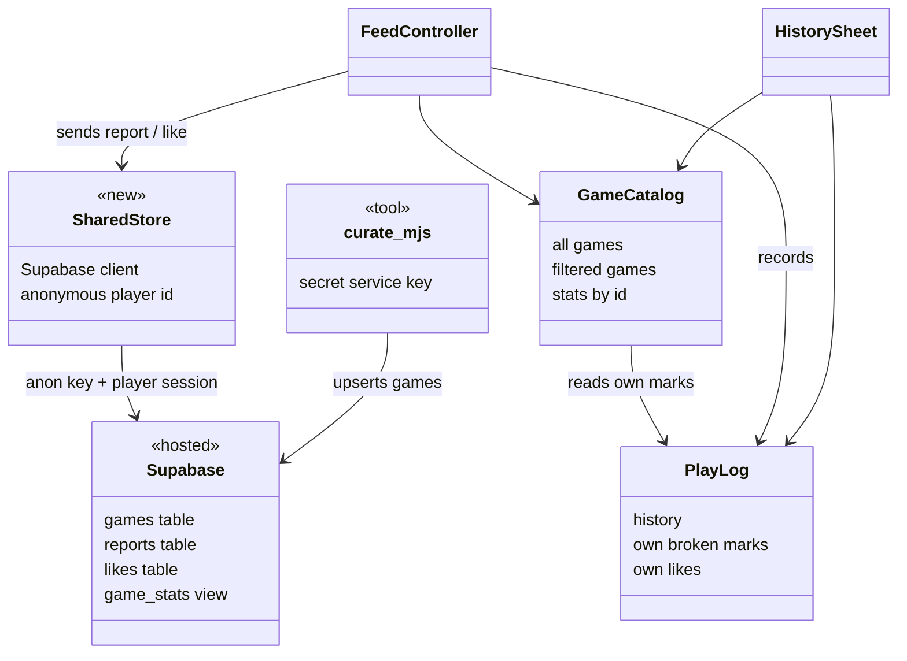
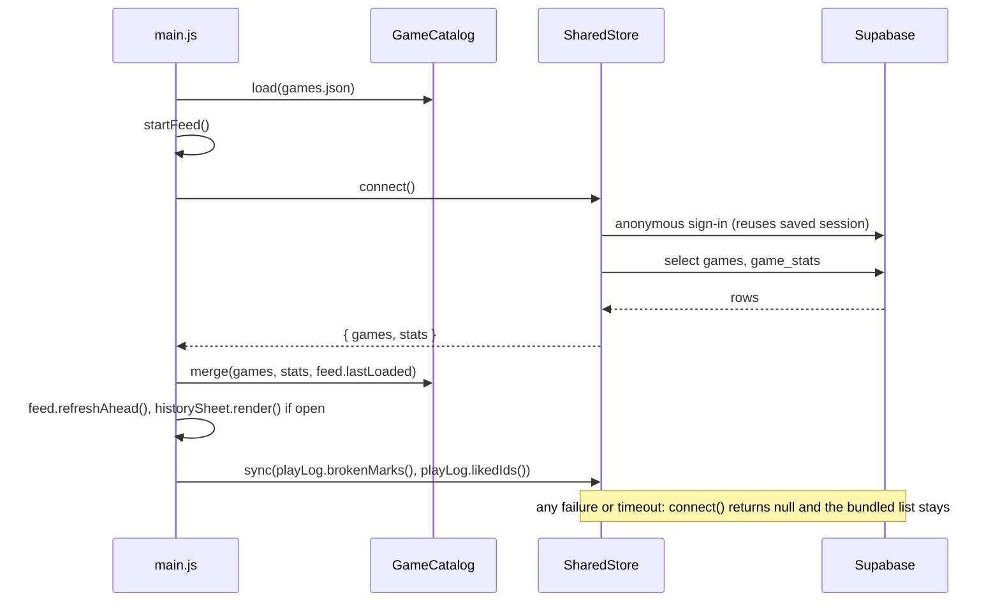
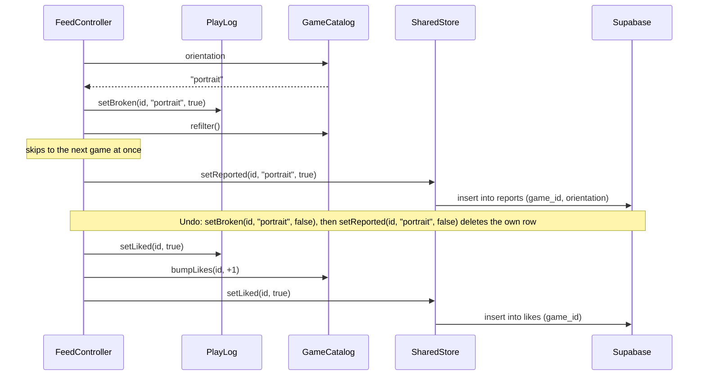
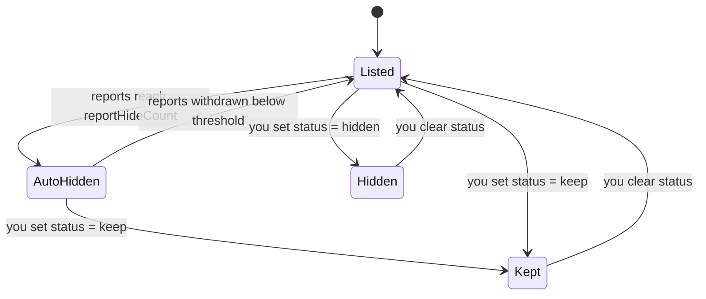

<!-- Created by Claude (claude-opus-5-5) -->
<!-- Date: 2026-10-05 -->

# Plan: Snackable Shared Data

| Field | Value |
|---|---|
| Status | Draft |
| Created | 2026-10-05 |
| Updated | 2026-10-05 |
| Proficiency | 3/10 |
| Engine | HTML / CSS / vanilla JS (ES modules) on GitHub Pages, Supabase (Postgres) as the hosted database |
| Revisions | 1 (latest: U-001) |
| Summary | One game list, broken reports and like counts shared by every player through Supabase, with the bundled `games.json` as the offline fallback. Designs the database and likes todos from plan 0001. |

## Revision Log

| ID | Date | Type | Change |
|---|---|---|---|
| U-001 | 2026-10-05 | Update | Open questions answered. Reports and own ⚑ marks apply per orientation. Likes weight the shuffle of games not yet loaded. A weekly GitHub Action keeps the free project awake. CAPTCHA waits until abuse appears. The `game_stats` view bypassing RLS is accepted. |

---

## Overview

Today every phone keeps its own broken marks, and the only way to share them is copying a list into `tools/blocklist.txt` by hand. This plan adds a hosted Supabase database that every player reads and writes. Each ⚑ becomes a report tagged with the phone's orientation, and a game with 3 reports in one orientation leaves everyone's feed in that orientation unless you override it. A new ♥ in the strip likes a game, with a shared count beside it and a Favorites filter in History, and liked games come up sooner in everyone's feed. The game list moves into a `games` table that `curate.mjs` fills. The app always starts from the bundled `games.json` and swaps in the shared data when Supabase answers, so it stays fast, works offline and survives the free project pausing.

Decisions:

| Topic | Decision | Reason |
|---|---|---|
| Shared data | Game list, broken reports, like counts | Reports and likes are written by players and need a shared store. The list moves too, so it can change without a deploy. |
| Identity | Supabase anonymous sign-in | No login screen. The database allows one report and one like per player per game. Clearing site data allows a repeat vote, which is acceptable for a prototype. Upgradable to a real login later. |
| Service | Supabase | Postgres counts and thresholds are one SQL view. Anonymous sign-in and per-row access rules are built in. Free tier pauses after about a week with no traffic. |
| Start-up | Start from bundled `games.json`, merge shared data when it arrives | No added wait; works offline and while the project is paused. |
| Failed sends | `PlayLog` is the truth for your own marks and likes; `sync()` after each sign-in makes your rows match | Retries are automatic and there is no second queue to keep in step. |
| Reports | Auto-hide at `config.reportHideCount` (3); `games.status` of `keep` or `hidden` overrides | Broken games clear themselves; false reports can be undone from the dashboard. |
| Report orientation | Reports and own ⚑ marks record `portrait` or `landscape` and hide the game only in that orientation | Square-ish games show in both orientations and some only break in one. One rule for own marks and shared counts, so History's ⚑ and the shared hiding agree. |
| Ranking | Weighted shuffle, weight `1 + likes`, applied in `merge()` to games not yet loaded | Liked games surface sooner; every game still appears once per loop, so new games get seen and liked. |
| Keep awake | Weekly GitHub Action reads one row from Supabase | A free project pauses after about a week with no traffic. |
| CAPTCHA | None until reports are abused, then Supabase's Cloudflare Turnstile on sign-in | No friction while the player base is small. |
| Blocklist | `games.status = 'hidden'` replaces `tools/blocklist.txt` | One place to hide a game for everyone. |

Terms:

- **Row-level security (RLS)**: per-row access rules inside Postgres, such as "a player may only insert a report with their own id". The app ships a public anon key that anyone can read from the page, so these rules are what keep the data safe. Every table must have RLS switched on.
- **View**: a saved query that reads like a table. `game_stats` counts reports and likes per game.
- **Upsert**: insert a row, or update it when one with the same id already exists.
- **Service key**: a secret Supabase key that skips RLS. Only `curate.mjs` uses it, from your machine or a GitHub Action secret, never from the app.

## Architecture



`main.js` passes what `SharedStore.connect()` returns into `GameCatalog.merge()`, so the catalog never talks to Supabase itself.

## Key Flows

### Start-up



### Report or like



Sends are not awaited. A failed send leaves the server one step behind until the next `sync()`.

### Game visibility

Evaluated separately for each orientation: report counts are per orientation, `status` applies to both.



`Kept` stays in the feed whatever the report count. A game you marked broken yourself stays out of your own feed in that orientation in every state.

## Components

### SharedStore (new, `js/sharedStore.js`)
Responsibility: the only code that talks to Supabase. Signs in anonymously, loads the shared list and counts, and sends the player's reports and likes.
Owns: the Supabase client and the player id.
Pattern: Repository (light), mirroring `PlayLog` for the remote side.

The client loads from `https://cdn.jsdelivr.net/npm/@supabase/supabase-js@2/+esm`. It saves its sign-in session in `localStorage` under its own `sb-...` key, the one exception to `PlayLog` owning `localStorage`.

Stub:
```js
export class SharedStore {
  #client = null; // null when url is empty or connect() failed; every method is then a no-op
  #playerId = null;

  /** Empty url turns the store off and the app runs on games.json alone. */
  constructor(url, anonKey, timeoutMs) {}

  /** Anonymous sign-in, then games + game_stats. { games: Entry[], stats: Map<id, { reportsPortrait, reportsLandscape, likes }> }, or null on error or timeout. Maps snake_case columns to entry fields. */
  async connect() {}

  /** Inserts and deletes the player's own report and like rows until they match. brokenMarks: [{ id, orientation }]. Errors are swallowed; the next start retries. */
  async sync(brokenMarks, likedIds) {}

  /** Inserts or deletes the player's report row for one orientation ("portrait" | "landscape"). Not awaited by callers. */
  setReported(id, orientation, isReported) {}

  /** Inserts or deletes the player's like row. Not awaited by callers. */
  setLiked(id, isLiked) {}

  get isConnected() {}
}
```

### GameCatalog (changed)
Responsibility: adds shared counts and status to the filter, weights the feed order by likes, and swaps in the shared list without losing the player's place.
Owns: adds `#stats` (`Map<id, { reportsPortrait, reportsLandscape, likes }>`) and `#reportHideCount`.

Methods:
- `merge(games, stats, lastLoaded)`: keeps the order of `#all` up to and including `lastLoaded` (the last entry already in a slot) and reuses those entry objects. Everything after it, known and new games alike, is reordered by a weighted shuffle. Games no longer listed drop out. Stores stats, then `refilter()`. Reusing objects matters because `refreshAhead()` finds the game on screen with `indexOf(entry)`; keeping the order through `lastLoaded` means no preloaded slot is thrown away.
- Weighted shuffle: give each game the key `Math.random() ** (1 / (1 + likes))` and sort by key, highest first. A game with more likes tends to come earlier, every game appears once, and with no likes it is a plain shuffle.
- `refilter()`: for the current orientation, hides `status === "hidden"`, games with that orientation's report count `>= reportHideCount` unless `status === "keep"`, and games the player marked broken in that orientation.
- `orientation`: `"portrait"` or `"landscape"`, for tagging reports and marks.
- `stats(id)`: `{ reportsPortrait, reportsLandscape, likes }`, zeros when unknown.
- `bumpLikes(id, delta)`: changes the shown count at once, before the server answers.

Stub:
```js
#stats = new Map();
#reportHideCount;

/** reportHideCount: reports in one orientation that hide a game there for everyone unless its status is "keep". */
constructor(squareTolerance, playLog, reportHideCount) {}

/** Swaps in the shared list. Order is kept through lastLoaded (null keeps nothing); the rest is weighted-shuffled by likes. Calls refilter(). */
merge(games, stats, lastLoaded) {}

/** "portrait" | "landscape", from the last setOrientation(). */
get orientation() {}

/** { reportsPortrait, reportsLandscape, likes }; zeros for an unknown id. */
stats(id) {}

/** Optimistic like count change for the strip. */
bumpLikes(id, delta) {}
```

### PlayLog (changed)
Responsibility: adds the player's own likes, stored under `snackable.likes`, and makes broken marks per orientation.

`snackable.broken` changes from a list of ids to a list of `{ id, orientation }`. On load, an old plain id becomes two marks, one per orientation, so nothing marked today reappears.

Stub:
```js
/** True when the player marked this game broken in that orientation. */
isBroken(id, orientation) {}
/** Writes snackable.broken. */
setBroken(id, orientation, isBroken) {}
/** [{ id, orientation }] sorted by id, for SharedStore.sync(). Replaces brokenIds(). */
brokenMarks() {}

isLiked(id) {}
/** Writes snackable.likes. */
setLiked(id, isLiked) {}
/** Sorted, for SharedStore.sync() and the Favorites list. */
likedIds() {}
```

### FeedController (changed)
Responsibility: sends reports and likes alongside the local marks and shows ♥ and the count in the strip.

Methods:
- `constructor(catalog, pool, strip, config, playLog, store)`: `strip` gains `likeButton` and `likeCount`.
- `markCurrentBroken()`: marks and reports in `catalog.orientation`. Returns `{ id, orientation }` for the Undo toast, so Undo clears the orientation the mark was made in even if the phone rotated since.
- `setBroken(id, orientation, isBroken)`: also calls `store.setReported(id, orientation, isBroken)`.
- `lastLoaded`: the entry in the last ahead slot, for `catalog.merge()`.
- `toggleLikeCurrent()`: flips `playLog.setLiked`, `catalog.bumpLikes` and `store.setLiked`, then updates the strip. Returns the new state, or null when no game is on screen.

### HistorySheet (changed)
Responsibility: adds an All / Favorites switch. Favorites lists every liked game through `catalog.find(id)` over `playLog.likedIds()`, so it covers more than the last 50 played. Rows show the like count. A row's ⚑ shows and toggles the mark for the current orientation, and the sheet re-renders on rotation as it does today.

### main.js and config (changed)
`config` gains `supabaseUrl`, `supabaseAnonKey` (both public), `reportHideCount: 3` and `connectTimeoutMs: 8000`. `main.js` creates the store, wires the ♥ button, and after `startFeed()` runs connect, merge, `refreshAhead()` and sync as in the start-up flow. The no-feed fallback path in `onToggleBroken` also calls `store.setReported`. Before the feed exists, `merge()` gets `lastLoaded` null.

### curate.mjs (changed)
Adds `--push`: after writing `games.json`, upserts every game into the `games` table through the Supabase REST API with the `SUPABASE_SERVICE_KEY` and `SUPABASE_URL` environment variables. It never sends `status`, so dashboard overrides survive a re-curate, and never deletes rows, so reports stay attached to removed games. `tools/blocklist.txt` and its filtering are removed once `status` is in use.

### Keep-awake workflow (`.github/workflows/snackable-keepalive.yml`, new)
Responsibility: stops the free Supabase project pausing by reading one row each week.

Runs on `schedule` (`cron: "0 9 * * 1"`, Mondays) and `workflow_dispatch`. One step: `curl --fail "$SUPABASE_URL/rest/v1/games?select=id&limit=1" -H "apikey: $SUPABASE_ANON_KEY"`, with both values from repository variables (they are public, so variables are enough). A failed run emails the repo owner, which doubles as an outage alert. Permissions: none beyond the default read.

### Database (`tools/schema.sql`, new)
Pasted once into the Supabase SQL editor. Also switch on Anonymous sign-ins under Authentication settings.

```sql
create table games (
  id text primary key,
  source text not null,
  title text not null,
  author text not null,
  embed_url text not null,
  page_url text not null,
  cover_image text not null default '',
  width int not null default 0,
  height int not null default 0,
  status text check (status in ('keep', 'hidden')),
  added_at timestamptz not null default now()
);

create table reports (
  game_id text not null references games (id) on delete cascade,
  player_id uuid not null default auth.uid() references auth.users (id) on delete cascade,
  orientation text not null check (orientation in ('portrait', 'landscape')),
  created_at timestamptz not null default now(),
  primary key (game_id, player_id, orientation)
);

create table likes (
  game_id text not null references games (id) on delete cascade,
  player_id uuid not null default auth.uid() references auth.users (id) on delete cascade,
  created_at timestamptz not null default now(),
  primary key (game_id, player_id)
);

alter table games enable row level security;
alter table reports enable row level security;
alter table likes enable row level security;

-- Explicit Data API access; RLS policies below narrow it to the right rows.
grant select on games to anon, authenticated;
grant select, insert, delete on reports, likes to authenticated;

create policy "anyone reads games" on games for select using (true);

create policy "read own reports" on reports for select to authenticated using (player_id = auth.uid());
create policy "add own reports" on reports for insert to authenticated with check (player_id = auth.uid());
create policy "remove own reports" on reports for delete to authenticated using (player_id = auth.uid());
create policy "read own likes" on likes for select to authenticated using (player_id = auth.uid());
create policy "add own likes" on likes for insert to authenticated with check (player_id = auth.uid());
create policy "remove own likes" on likes for delete to authenticated using (player_id = auth.uid());

-- Runs as its owner, so it counts every player's rows while exposing only totals.
create view game_stats with (security_invoker = false) as
select g.id as game_id,
  (select count(*) from reports r where r.game_id = g.id and r.orientation = 'portrait') as reports_portrait,
  (select count(*) from reports r where r.game_id = g.id and r.orientation = 'landscape') as reports_landscape,
  (select count(*) from likes l where l.game_id = g.id) as likes
from games g;
grant select on game_stats to anon, authenticated;
```

## Patterns Applied

| Pattern | Where | Why |
|---|---|---|
| Repository (light) | SharedStore | One owner for every Supabase call, so errors, timeouts and the off switch are handled in one file. |
| Stale-while-revalidate | main.js start-up | Show the bundled list at once and swap in fresher shared data when it arrives. |
| Optimistic update | FeedController, `bumpLikes` | The strip reacts on tap; the server catches up or the next `sync()` repairs it. |

## Open Questions
- [x] Anonymous sign-ins can be scripted to create many players. Decided: add Supabase's CAPTCHA (Cloudflare Turnstile) on sign-in only once reports are abused.
- [x] Rank the feed by likes? Decided: weighted shuffle in `merge()`.
- [x] Free projects pause after about a week with no traffic. Decided: weekly keep-awake GitHub Action.
- [x] Should a report carry its orientation? Decided: yes, and reports and own marks hide per orientation.
- [x] Supabase's database linter flags views that bypass RLS. Accepted: `game_stats` does this on purpose and exposes only counts.
- [ ] Tune the like weight (`1 + likes`) once real counts exist; a few heavily liked games could crowd the start of every session.

## Implementation Notes

Build order:

1. **Supabase project.** Create the project, run `tools/schema.sql`, switch on Anonymous sign-ins, put the URL and anon key in `config`.
2. **curate.mjs `--push`.** Fill the `games` table from the current `games.json`; check the row count in the dashboard.
3. **SharedStore.connect() + GameCatalog.merge().** Start bundled, merge shared. Verify the game on screen keeps playing across the merge, and that an empty `supabaseUrl` or offline phone still plays the bundled list.
4. **Reports.** Per-orientation `PlayLog` marks with the old-format migration, `setReported`, `sync`, threshold and `status` in `refilter()`. Test with browser profiles: 3 portrait reports from 3 profiles hide a square game for a fourth in portrait only; `keep` brings it back; a mark made before this step still hides the game in both orientations.
5. **Likes.** PlayLog likes, ♥ and count in the strip, `toggleLikeCurrent()`, Favorites in History, weighted shuffle in `merge()`. Check the game on screen and the preloaded next game survive the merge.
6. **Keep-awake workflow.** Add the workflow and the two repository variables; run it once by hand from the Actions tab.
7. **Retire blocklist.** Move any ids in `tools/blocklist.txt` to `status = 'hidden'`, then remove the file, its filtering in `curate.mjs` and "Copy broken list" if it is no longer useful.

Gotchas:
- Never put the service key in `config.js` or any file under `apps/`; Pages publishes the whole folder.
- `game_stats` counts change while a player is mid-feed; only `merge()` at start-up applies them, so a session's feed stays stable.
- Scheduled workflows run only from the default branch, so the keep-awake starts after this merges to `main`. GitHub also disables schedules in a public repo after 60 days with no commits; re-enable it from the Actions tab if that happens.
- Entry fields stay camelCase (`embedUrl`, `pageUrl`, `coverImage`); `SharedStore` maps the snake_case columns.
- Every new `.js` / `.sql` file gets the attribution header.
